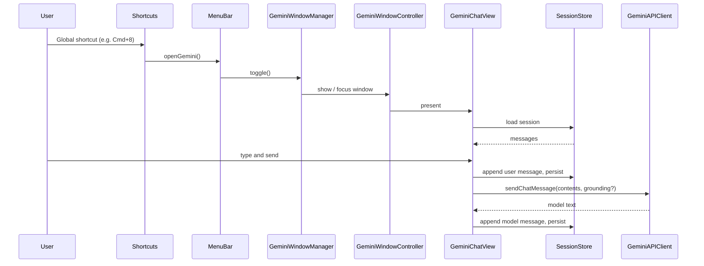

# Gemini Window, Persistent Session, and Google Grounding

## Scope (from your choices)

- **Gemini window**: Native SwiftUI chat using the existing Gemini API (not a WebView).
- **Ecosystem**: Gemini + native Google Grounding (use Gemini API’s grounding features; no custom CLI or OAuth in this phase).

---

## 1. Global shortcut for Gemini window

**Goal:** One configurable global shortcut that opens (or focuses) a dedicated “Gemini” window. Window is compact and restorable so it can sit alongside other work.

**Implementation:**

- **Shortcut plumbing** (same pattern as “Open Settings”):
  - [ShortcutConfig.swift](WhisperShortcut/ShortcutConfig.swift): Add `openGemini: ShortcutDefinition` to `ShortcutConfig` and default (e.g. `command+8`), and extend `ShortcutConfigManager` (new UserDefaults key, load/save, include in `saveConfiguration`).
  - [Shortcuts.swift](WhisperShortcut/Shortcuts.swift): Add `openGemini()` to `ShortcutDelegate`; add `openGeminiKey: HotKey?` and register it in `setupShortcuts(with:)` / clear in `cleanup()`.
  - [MenuBarController.swift](WhisperShortcut/MenuBarController.swift): Implement `openGemini()` (e.g. call a `GeminiWindowManager.shared.toggle()`), add menu item with shortcut in `createMenu()`, and implement the delegate method.
- **Settings UI**: In [SettingsConfiguration.swift](WhisperShortcut/Settings/Shared/SettingsConfiguration.swift) add `openGemini` / `openGeminiEnabled` to `SettingsData` and defaults; extend `SettingsViewModel` (load/save/validate) and add a focus field in `SettingsFocusField`. In [KeyboardShortcutsSection.swift](WhisperShortcut/Settings/Tabs/General/KeyboardShortcutsSection.swift) add a `ShortcutInputRow` for “Open Gemini window”.

**Window behavior:**

- **Single window**: One “Gemini” window per app (similar to [SettingsManager](WhisperShortcut/SettingsManager.swift): hold optional `GeminiWindowController`, `toggle()` = show/focus or hide).
- **Size and position**: Default to a compact size (e.g. 420–480 pt width, 520–600 pt height) and position (e.g. bottom-right of main screen with margin), so it doesn’t cover the whole workspace. Use `setFrameAutosaveName` so macOS restores frame.
- **Style**: Follow [SettingsWindowController](WhisperShortcut/SettingsWindowController.swift) patterns: `styleMask: [.titled, .closable, .resizable]`, `collectionBehavior` (e.g. `.fullScreenNone`, `.participatesInCycle`), min/max content size. No need to be floating if you want it to behave like a normal window for Cmd+Tab and Spaces.

---

## 2. Persistent session and chat history

**Goal:** When the user triggers the shortcut, the same window and the full chat for the “current session” are restored (no loss of conversation).

**Session model:**

- **One active session**: One ongoing conversation (list of messages). Optional: “New chat” to start a fresh session (then previous one can be kept as history or discarded; minimal scope = one session that persists).
- **Persistence**: Store in Application Support (respect sandbox vs non-sandbox as in [AppSupportPaths](WhisperShortcut/AppSupportPaths.swift) / project rules). One file per session or one file for “current session” (e.g. `gemini-chat-session.json`) containing:
  - Session id, last updated timestamp.
  - Array of messages: `role` (user/model), `content` (text), optional `timestamp`.
- **Restore on open**: When `openGemini()` runs, `GeminiWindowManager` shows the window; the SwiftUI chat view loads the persisted session and displays it. New messages append and are written to disk (e.g. after each exchange or on a short debounce).

**Window persistence:**

- Use `setFrameAutosaveName("GeminiWindow")` so the window’s frame (and position) is restored by the system across restarts. No extra “remember position” logic needed beyond that.

---

## 3. Native SwiftUI chat UI and Gemini API

**Chat UI:**

- New SwiftUI view (e.g. `GeminiChatView`): message list (ScrollView + LazyVStack), text field + send button, loading state, error state (inline or small banner). Use existing `DebugLogger` for logs; no `print`/`NSLog`.
- New window controller (e.g. `GeminiWindowController`): `NSWindow` with `NSHostingController(rootView: GeminiChatView(...))`, same sizing/positioning as above. Owner: a small `GeminiWindowManager` (singleton) that creates the controller once and implements `toggle()` / `show()` / `close()`.

**Gemini API for chat:**

- **Multi-turn**: Gemini Generative Language API uses a `contents` array of turns (e.g. `role: "user"` / `role: "model"` with `parts: [{ text: "..." }]`). The app currently uses the same API for transcription/prompt; add a dedicated “chat” path that sends and receives this structure.
- **New API surface in [GeminiAPIClient.swift](WhisperShortcut/GeminiAPIClient.swift)** (or a small helper that uses it):
  - Method such as `sendChatMessage(model: String, contents: [[String: Any]], systemInstruction: String?) async throws -> String` (or a typed `Content`/`Part` model). Build the request body per [Gemini generateContent docs](https://ai.google.dev/gemini-api/docs), parse the first candidate’s text from the response.
  - Use existing credential (KeychainManager / GeminiCredentialProvider), existing retry/rate-limit behavior where possible.
- **Model choice**: Use one of the existing chat-capable models from [SettingsConfiguration](WhisperShortcut/Settings/Shared/SettingsConfiguration.swift) / [TranscriptionModels](WhisperShortcut/TranscriptionModels.swift) (e.g. Gemini 2.5 Flash). Optionally make the chat model configurable in Settings later; for the first version a fixed default is enough.

**Flow:**

- User types and sends → append user message to in-memory session and persist → call Gemini with full `contents` → append model reply to session and persist → update UI.

---

## 4. Google native grounding

**Goal:** Use “native Google Grounding” so Gemini can use up-to-date or factual information (e.g. Google Search, and if available, Workspace data).

**Implementation approach:**

- Rely on the **Gemini API’s grounding features** as documented by Google (e.g. [Gemini API docs](https://ai.google.dev/gemini-api/docs), and the **gemini-model-docs** skill for current model and tool support). Common options:
  - **Google Search grounding**: Tool such as `google_search_retrieval` (or equivalent in the request) so model responses can be grounded in search results. This fits “ecosystem integration” without building custom OAuth or CLI.
  - **Workspace (Gmail/Calendar)**: If the same API key and model support grounding with Gmail/Calendar (e.g. via Vertex or specific enablement), the same chat request can request that tool; otherwise document “future: Gmail/Calendar via API when available” and only implement Search for now.
- **Concrete steps**: In the new chat request builder, add the appropriate `tools` / `toolConfig` (or equivalent) to the generateContent payload when the user has “grounding” enabled. Add a simple setting (e.g. “Use Google Search grounding in Gemini chat”) and pass it into the chat API call. No new OAuth or custom CLI in this phase.

**Note:** Exact request shape and tool names must be verified against the current Gemini API (REST) documentation and the gemini-model-docs skill; implementation details may vary by model and product (Generative Language API vs Vertex).

---

## 5. Data flow (high level)

---

## 6. File and type changes summary

| Area                | Files to add or touch                                                                                                                                                         |
| ------------------- | ----------------------------------------------------------------------------------------------------------------------------------------------------------------------------- |
| Shortcut config     | `ShortcutConfig.swift` (openGemini, manager key + load/save), `Shortcuts.swift` (delegate + HotKey)                                                                           |
| Menu + delegate     | `MenuBarController.swift` (menu item, openGemini implementation, ShortcutDelegate)                                                                                            |
| Settings UI         | `SettingsConfiguration.swift` (data + defaults + focus), `SettingsViewModel.swift` (load/save/validate for new shortcut), `KeyboardShortcutsSection.swift` (ShortcutInputRow) |
| Window + manager    | New `GeminiWindowController.swift`, new `GeminiWindowManager.swift` (or equivalent names)                                                                                     |
| Chat UI             | New `GeminiChatView.swift` (SwiftUI: list, input, loading, errors)                                                                                                            |
| Session persistence | New `GeminiChatSessionStore.swift` (save/load JSON under Application Support)                                                                                                 |
| API                 | `GeminiAPIClient.swift` (add chat method with contents + optional tools for grounding)                                                                                        |

---

## 7. Order of implementation

1. **Shortcut and window shell**: Add `openGemini` to config, Shortcuts, MenuBarController, and Settings. Add `GeminiWindowManager` and `GeminiWindowController` with a minimal placeholder view (e.g. “Gemini” title + “Chat will appear here”). Build and test shortcut and window restore (frame autosave).
2. **Session persistence**: Implement `GeminiChatSessionStore` and wire it to the placeholder so the window shows a fixed “current session” (e.g. empty or one test message).
3. **Chat API and UI**: Implement `sendChatMessage` in `GeminiAPIClient`, then full `GeminiChatView` (send, receive, append to session, persist). Use existing credentials and error handling.
4. **Google grounding**: Verify Gemini API docs for grounding (e.g. Google Search), add optional tools to the chat request and a Settings toggle; no Gmail/Calendar until the API clearly supports it for your setup.

---

## 8. Out of scope / later

- Gmail/Calendar OAuth or custom CLI actions (you chose “Gemini + native Google Grounding” only).
- Multiple concurrent chat sessions or session list UI (optional “New chat” can be added later).
- Voice input in the Gemini window (could reuse existing recording later).

All UI and in-repo text must remain in **English** (per project rules). After implementation, run `bash scripts/rebuild-and-restart.sh` once to verify.
