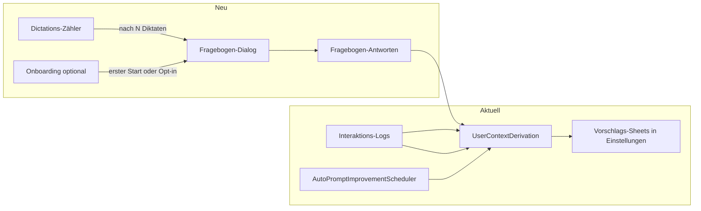

# KI-System-Prompts mit Nutzer-Fragebogen

## Ausgangslage

- **Bereits vorhanden:** [UserContextLogger](WhisperShortcut/UserContextLogger.swift) speichert Transkriptionen, Prompt- und Read-Aloud-Nutzung (JSONL). [AutoPromptImprovementScheduler](WhisperShortcut/AutoPromptImprovementScheduler.swift) startet in konfigurierbaren Intervallen (7/14/30 Tage) [UserContextDerivation](WhisperShortcut/UserContextDerivation.swift), die aus Logs per Gemini Vorschläge für Dictation-, Prompt-Mode- und Prompt-&-Read-System-Prompts sowie User Context erzeugt. Vorschläge erscheinen in den Einstellungen als Vergleichs-Sheet (Apply/Dismiss).
- **Fehlend:** Trigger **nach N Diktaten**; **Dialog mit gezielten Fragen** (Ja/Nein oder Freitext); **Einbeziehung der Fragebogen-Antworten** in die Prompt-Ableitung.

## Architektur-Überblick

## 1. Trigger: Nach N Diktaten

- **Neuer Zähler:** Eigenständiger Zähler nur für Prompt-Verbesserung (nicht `successfulOperationsCount` von [ReviewPrompter](WhisperShortcut/ReviewPrompter.swift) verwenden). Z.B. UserDefaults-Keys: `promptImprovementDictationCount`, optional `lastPromptImprovementQuestionnaireDate` (Mindestabstand zwischen Fragebogen).
- **Inkrement:** In [MenuBarController](WhisperShortcut/MenuBarController.swift) an der Stelle, wo nach erfolgreicher Transkription `UserContextLogger.shared.logTranscription(...)` und `reviewPrompter.recordSuccessfulOperation(...)` aufgerufen werden, zusätzlich den neuen Zähler erhöhen.
- **Bedingungen:** Nur inkrementieren/auswerten wenn Auto-Improvement nicht auf "Nie" steht und Logging aktiv ist (analog zu [AutoPromptImprovementScheduler.shouldRun()](WhisperShortcut/AutoPromptImprovementScheduler.swift)). Wenn Zähler >= N und mind. 7 Tage seit letztem Fragebogen: Fragebogen anzeigen, danach Zähler zurücksetzen und `lastPromptImprovementQuestionnaireDate` setzen.
- **N:** Fest 25 in [AppConstants](WhisperShortcut/AppConstants.swift) (siehe Entschieden).

## 2. Fragebogen-Dialog

- **Neue View:** SwiftUI-View (z.B. `PromptImprovementQuestionnaireView`) mit kurzer Einleitung und 4–6 Fragen zu für System-Prompts relevanten Punkten. Beispiele: Transkriptionsqualität (Ja/Nein), wiederkehrende Fachbegriffe/Rechtschreibung (Freitext), gewünschte Anweisungsbehandlung (Ja/Nein/ Kurztext). Pro Frage: Label + Steuerung (Toggle oder TextField).
- **Datenmodell:** Struct (Codable) für alle Antworten; Persistenz in UserContext-Verzeichnis (z.B. `questionnaire-last.json` oder `.md`), damit [UserContextDerivation](WhisperShortcut/UserContextDerivation.swift) sie lesen kann.
- **Anzeige:** Dialog als Sheet oder eigenes Fenster. Präsentation von MenuBar aus: Zugriff auf Fenster wie bei ReviewPrompter (z.B. `statusItem?.button?.window`) oder über zentralen Coordinator (z.B. neuer `PromptImprovementQuestionnaireManager`), der das Fenster hält und die View als Sheet präsentiert.
- **Nach Absenden:** Antworten speichern, Zähler zurücksetzen, optional sofort einen Improvement-Lauf mit Fragebogen-Kontext starten (siehe unten), dann Einstellungen öffnen und/oder Benachrichtigung posten, damit vorhandene Vorschlags-Sheets angezeigt werden.

## 3. Ableitung mit Fragebogen-Antworten

- **Erweiterung UserContextDerivation:** Beim Aufruf von `updateFromLogs(focus:)` (bzw. beim Aufbau des Gemini-Requests in `callGeminiForAnalysis`) die zuletzt gespeicherten Fragebogen-Antworten einlesen. Wenn vorhanden: einen zusätzlichen Abschnitt im System- oder User-Prompt übergeben, z.B. "User questionnaire answers (use to refine system prompts): …". Keine Änderung der Marker-Logik; nur mehr Kontext für das Modell.
- **Datei:** Einheitliche Datei für „letzte Fragebogen-Antworten“ (z.B. `questionnaire-last.md` mit strukturiertem Text oder JSON), von [UserContextLogger](WhisperShortcut/UserContextLogger.swift)-Verzeichnis aus lesbar (gleiches `directoryURL` / Application Support).

## 4. Ablauf (periodisch)

- **Zeitbasiert (unverändert):** Scheduler läuft weiter nach 7/14/30 Tagen; nutzt Logs und, falls vorhanden, die neuesten Fragebogen-Antworten.
- **Diktat-basiert (neu):** Nach N erfolgreichen Diktaten → Fragebogen anzeigen → Antworten speichern → optional sofort Improvement-Lauf mit Logs + Fragebogen starten → Vorschläge wie gewohnt in Einstellungen (Apply/Dismiss). Zeitbasierten Lauf nicht ersetzen; beide Trigger können koexistieren (Fragebogen liefert zusätzlichen Kontext für den nächsten Lauf, ob sofort oder beim nächsten Zeit-Trigger).

## 5. Onboarding-/Initial-Fragebogen (optional)

- **Zweck:** Kontext von Anfang an (Cold-Start mildern). Fragen wie „Wofür nutzt du Diktieren?“, „Fachgebiet/Branche?“, ggf. Sprache. Antworten fließen in die gleiche Ableitung wie die periodischen Fragebogen-Antworten.
- **Trigger (eine oder beide Varianten):**
  - **A) Einmal beim ersten App-Start:** UserDefaults-Flag z.B. `hasCompletedOnboardingQuestionnaire`. Beim ersten Start nach Install kurzen Dialog anzeigen (2–4 Fragen), „Überspringen“ anbieten. Nach Absenden oder Überspringen Flag setzen, danach nie wieder automatisch beim Start.
  - **B) Opt-in in Einstellungen:** In [GeneralSettingsTab](WhisperShortcut/Settings/Tabs/GeneralSettingsTab.swift) Button „System-Prompts verbessern“ / „Kurze Fragen zur Anpassung“ → öffnet denselben oder einen vereinfachten Fragebogen. Nutzer kann jederzeit erneut antworten (Antworten überschreiben oder an „questionnaire-last“ anfügen, je nach Speichermodell).
- **Inhalt:** 2–4 kurze Fragen (Nutzungszweck Diktat, Fachgebiet, optional Sprache), überwiegend Ja/Nein oder kurze Freitextfelder. Kein zweiter, inhaltlich anderer Fragebogen nötig – gleiches Datenmodell/Speicher wie periodischer Fragebogen, nur anderer Trigger.
- **Speicherung & Ableitung:** Wie bei periodischem Fragebogen: Antworten im UserContext-Verzeichnis ablegen (z.B. dieselbe `questionnaire-last.md` / JSON). [UserContextDerivation](WhisperShortcut/UserContextDerivation.swift) liest „letzte Fragebogen-Antworten“ unabhängig davon, ob von Onboarding oder von periodischem Dialog – ein gemeinsamer Block „User questionnaire answers“ im Gemini-Request. Optional: Onboarding-Antworten als „initial context“ in separater Datei dauerhaft behalten und bei Derivation mit periodischen Antworten zusammenführen.
- **Einführungsort:** Erstes Start: in [FullApp](WhisperShortcut/FullApp.swift) / App-Delegate nach `applicationDidFinishLaunching` prüfen ob Flag gesetzt; wenn nicht, nach kurzer Verzögerung (z.B. nach Anzeige des Menüleisten-Icons) Dialog anzeigen (eigenes Fenster oder Sheet, analog periodischer Dialog). Opt-in: nur [GeneralSettingsTab](WhisperShortcut/Settings/Tabs/GeneralSettingsTab.swift) um Button + Präsentation der gleichen Questionnaire-View erweitern.

## Wichtige Dateien

| Bereich              | Dateien                                                                                                                                                                                                                        |
| -------------------- | ------------------------------------------------------------------------------------------------------------------------------------------------------------------------------------------------------------------------------ |
| Zähler & Trigger     | [MenuBarController](WhisperShortcut/MenuBarController.swift), [UserDefaultsKeys](WhisperShortcut/UserDefaultsKeys.swift), ggf. [AppConstants](WhisperShortcut/AppConstants.swift)                                              |
| Dialog & Speicherung | Neue View + Coordinator/Manager, [UserContextLogger](WhisperShortcut/UserContextLogger.swift) (Pfad/Verzeichnis)                                                                                                               |
| Ableitung            | [UserContextDerivation](WhisperShortcut/UserContextDerivation.swift) (Logs laden + Fragebogen-Datei lesen, in Gemini-Request einbauen)                                                                                         |
| Einstellungen        | [GeneralSettingsTab](WhisperShortcut/Settings/Tabs/GeneralSettingsTab.swift) optional für N oder Toggle „Fragebogen nach N Diktaten“; bei Opt-in Onboarding: Button + Präsentation Questionnaire-View                          |
| Onboarding           | [FullApp](WhisperShortcut/FullApp.swift) / App-Delegate (erster Start), UserDefaults-Flag für „Fragebogen einmal gezeigt“, ggf. [GeneralSettingsTab](WhisperShortcut/Settings/Tabs/GeneralSettingsTab.swift) für Opt-in-Button |

## Best Practices (Literatur & Praxis)

### Feedback-Arten kombinieren

- **Implizites Feedback** (bereits umgesetzt): Logs von Transkriptionen, Prompt-Nutzung, Read-Aloud. Skalierbar und wenig störend; liefert aber oft „rauschiges“ Signal (z.B. Bearbeitungen können unterschiedliche Gründe haben). Forschung zeigt: Nur implizites Feedback reicht für komplexe Aufgaben oft nicht.
- **Explizites Feedback** (Fragebogen): Gezielte Fragen liefern klarere Signale. **Empfehlung:** Beides nutzen – Logs für Kontext/Domain, Fragebogen für klare Präferenzen und Fehlermodi. Das entspricht eurem geplanten Mix.

### Evaluation-Flywheel (OpenAI u.a.)

Dreischritt für kontinuierliche Prompt-Verbesserung:

1. **Analyse:** Fehlermodi und Muster identifizieren (qualitativ).
2. **Messen:** Baselines und Metriken (z.B. über Testfälle oder Nutzerantworten).
3. **Verbessern:** Gezielte Anpassungen an Prompts/System und erneut messen.

Der Fragebogen liefert hier vor allem **Analyse-Input** (was läuft schlecht?) und optional **Mess-Input** (z.B. „War das Ergebnis nützlich?“ Ja/Nein).

### Fragebogen-Design (In-App-Surveys)

- **Kurz halten:** 1–2 Fragen bringen oft mehr Antworten als lange Formulare. **Pragmatisch:** 3–5 sehr kurze Fragen (Ja/Nein + 1–2 optionale Freitextfelder) sind ein guter Kompromiss für euren Use Case.
- **Timing:** Nach **erfolgreicher, bedeutsamer Aktion** fragen (z.B. nach N Diktaten) – Nutzer haben Kontext und haben etwas erreicht. Nicht mitten in der Arbeit abfragen.
- **Frequenz begrenzen:** Mindestabstand zwischen zwei Fragebogen (z.B. 7–14 Tage) reduziert Survey-Fatigue und wirkt wie ein „Rate Limit“.
- **Preferenz statt Skala:** Statt „1–5“ lieber **Ja/Nein** oder **„A vs. B“** (Preferenz); solche Vergleiche gelten in der Forschung als zuverlässiger für Prompt-Optimierung.

### Preference-basierte Optimierung

- Arbeiten wie **APOHF** (Automated Prompt Optimization with Human Feedback) nutzen **Preferenzvergleiche** („Antwort A oder B besser?“) statt numerischer Bewertungen – weniger kognitiver Aufwand, bessere Qualität des Feedbacks.
- Für WhisperShortcut: Statt „Wie zufrieden 1–5?“ besser konkrete Ja/Nein-Fragen („Waren die Transkriptionen meist korrekt?“) oder eine optionale Freitextzeile für Fachbegriffe/Probleme.

### Technische Einordnung eures Ansatzes

- **Agent-in-the-Loop:** Feedback direkt in den Workflow einbauen (nach N Diktaten) statt nur zeitgesteuert – entspricht dem geplanten count-basierten Trigger.
- **System-Level-Feedback:** Fragebogen-Antworten als **zusätzlicher Kontext** in die Ableitung (UserContextDerivation) zu geben, statt nur Einzelfälle zu optimieren – passt zur geplanten Nutzung in `callGeminiForAnalysis`.

### Konkrete Empfehlungen für die Umsetzung

| Aspekt        | Empfehlung                                                                                              |
| ------------- | ------------------------------------------------------------------------------------------------------- |
| Anzahl Fragen | 3–5, davon mindestens 2–3 Ja/Nein; 1–2 optionale Kurztextfelder                                         |
| Trigger       | Nach N Diktaten (wie geplant); zusätzlich Mindestabstand z.B. 7 Tage                                    |
| Kombination   | Immer Logs + Fragebogen gemeinsam in Derivation (wie im Plan)                                           |
| UX            | Dialog erst nach erfolgreichem Abschluss einer Aktion; „Überspringen“ anbieten, um Abbruch zu vermeiden |

## Entschieden (Empfehlungen)

- **N:** Fest 25 (keine Einstellung in v1). Konstante in [AppConstants](WhisperShortcut/AppConstants.swift); bei Bedarf später Einstellung 20/30/50 nachziehen.
- **Mindestabstand:** Ja, 7 Tage. Nur anzeigen wenn zusätzlich zu „Zähler >= N“ mindestens 7 Tage seit `lastPromptImprovementQuestionnaireDate` vergangen (oder noch nie gezeigt). Verhindert Doppel-Dialog bei schneller Nutzung.
- **Sofort-Lauf:** Ja. Nach Absenden des Fragebogens sofort Improvement-Lauf (Logs + Fragebogen), Vorschläge in Dateien schreiben, Einstellungen öffnen und `autoImprovementSuggestionsReady` posten – bestehende Sheet-Logik zeigt Vorschläge.
- **Onboarding:** Beides (A + B). Einmal beim ersten Start (mit „Überspringen“) + Opt-in-Button in Einstellungen; dieselbe Questionnaire-View wiederverwenden.
