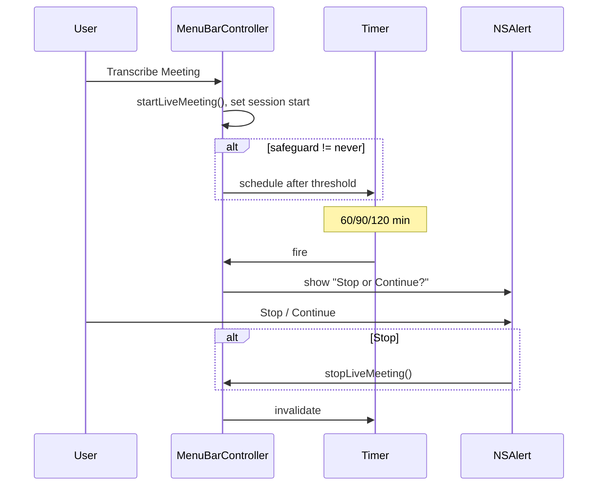

# Safeguard für Live-Meeting-Transkription (Zeit-Pop-up)

## Ausgangslage

- **Diktat-Safeguard** (bereits vorhanden): Nach dem Stopp der Aufnahme prüft [MenuBarController.swift](WhisperShortcut/MenuBarController.swift) (ca. Zeilen 1396–1425) die Aufnahmedauer. Überschreitet sie den in den Einstellungen gewählten Schwellwert ([ConfirmAboveDuration](WhisperShortcut/Settings/Shared/SettingsConfiguration.swift): 1/2/5/10 Min. oder „Never“), erscheint ein `NSAlert` mit „Process“ / „Cancel“. Der Wert kommt aus UserDefaults (`confirmAboveDurationSeconds`) und wird in [GeneralSettingsTab](WhisperShortcut/Settings/Tabs/GeneralSettingsTab.swift) unter „Recording Safeguards“ konfiguriert.
- **Live Meeting**: Start in [MenuBarController.startLiveMeeting()](WhisperShortcut/MenuBarController.swift) (ca. 488–533): `liveMeetingSessionStartTime = Date()`, `LiveMeetingRecorder` startet, es gibt **keinen** zeitbasierten Hinweis während der Session. Beendet wird nur manuell über „Stop Transcribe Meeting“.

## Ziel

Während einer aktiven Live-Meeting-Session nach einer **konfigurierbaren** Dauer (z.B. 60 oder 90 Minuten) **einmalig** ein Dialog anzeigen:

- **„Meeting beenden“** (oder „Stop“) → Meeting stoppen wie bei manuellem Stop.
- **„Weiter transkribieren“** (oder „Continue“) → Dialog schließen, Transkription läuft weiter.

Optional (später): Bei „Weiter“ nach weiteren X Minuten erneut fragen (wird im Plan nur als Option erwähnt, nicht umgesetzt).

## Implementierung

### 1. Neues Enum und Defaults

- **Datei:** [SettingsConfiguration.swift](WhisperShortcut/Settings/Shared/SettingsConfiguration.swift)
- Neues Enum `**MeetingSafeguardDuration**` (analog zu `ConfirmAboveDuration`):
  - `never = 0`
  - `sixtyMinutes = 3600`
  - `ninetyMinutes = 5400`
  - `twoHours = 7200`
  - `displayName` für UI (z.B. „Never“, „60 minutes“, „90 minutes“, „2 hours“).
- In **SettingsDefaults**: z.B. `static let liveMeetingSafeguardDuration = MeetingSafeguardDuration.ninetyMinutes`.
- In **SettingsData**: neue Property `liveMeetingSafeguardDuration` mit diesem Default.

### 2. UserDefaults und ViewModel

- **Datei:** [UserDefaultsKeys.swift](WhisperShortcut/UserDefaultsKeys.swift)  
  - Neuer Key: `liveMeetingSafeguardDurationSeconds` (unter „Live Meeting Settings“).
- **Datei:** [SettingsViewModel.swift](WhisperShortcut/Settings/Shared/SettingsViewModel.swift)  
  - Beim **Laden**: Wert aus UserDefaults lesen und in `data.liveMeetingSafeguardDuration` mappen (falls kein Wert/ungültig → Default).  
  - Beim **Speichern**: `data.liveMeetingSafeguardDuration.rawValue` unter `liveMeetingSafeguardDurationSeconds` schreiben.

### 3. UI im Live-Meeting-Tab

- **Datei:** [LiveMeetingSettingsTab.swift](WhisperShortcut/Settings/Tabs/LiveMeetingSettingsTab.swift)  
  - Neue Sektion (z.B. zwischen Timestamps und „How to Use“): **„Safeguard“** / „Duration reminder“.
  - Kurzer Hinweistext: Nach X Minuten wird ein Hinweis angezeigt, um das Meeting optional zu beenden oder weiterlaufen zu lassen.
  - Picker gebunden an `viewModel.data.liveMeetingSafeguardDuration`: Optionen = alle Fälle von `MeetingSafeguardDuration` (Never, 60 min, 90 min, 2 h).
  - `onChange` → `viewModel.saveSettings()`.

### 4. Timer und Dialog im MenuBarController

- **Datei:** [MenuBarController.swift](WhisperShortcut/MenuBarController.swift)
  - **Neue Property:** `private var liveMeetingSafeguardTimer: Timer?`
  - **In `startLiveMeeting()**` (nach Setzen von `liveMeetingSessionStartTime` und vor dem Log „Session started“):
    - Schwellwert aus UserDefaults lesen (analog zu `confirmAboveDuration`): Key `liveMeetingSafeguardDurationSeconds`, Fallback auf `SettingsDefaults.liveMeetingSafeguardDuration` oder `.never`.
    - Wenn `threshold != .never`:
      - `liveMeetingSafeguardTimer` invalidieren/aufheben falls noch gesetzt.
      - Timer mit `TimeInterval(threshold.rawValue)`, `repeats: false` anlegen.
      - Im Fire-Block: **auf Main Dispatch** wechseln, prüfen `isLiveMeetingActive`; wenn nicht mehr aktiv, Timer nur invalidieren und return.
      - Wenn aktiv: `NSAlert` anzeigen:
        - Titel/Text z.B. „Long meeting“ / „This meeting has been transcribing for over X minutes. Stop or continue?“ (oder deutsche Variante je nach App-Sprache).
        - Zwei Buttons: „Stop meeting“ (oder „Meeting beenden“) und „Continue“ (oder „Weiter transkribieren“).
        - Bei „Stop meeting“: `stopLiveMeeting()` aufrufen.
        - Timer invalidieren und `liveMeetingSafeguardTimer = nil`.
    - Timer in `liveMeetingSafeguardTimer` speichern und auf dem Main RunLoop schedulen (z.B. `RunLoop.main.add(timer, forMode: .common)`), damit er zuverlässig feuert.
  - **In `stopLiveMeeting()` und `finishLiveMeetingSession()**`:
    - `liveMeetingSafeguardTimer?.invalidate()`
    - `liveMeetingSafeguardTimer = nil`

So bleibt der Safeguard optional („Never“), konfigurierbar (60/90/120 Min.) und verhält sich wie gewünscht: ein Pop-up nach Ablauf der Zeit mit Wahl zwischen Beenden und Weiterlaufen.

### 5. Logging

- Beim Start des Timers: `DebugLogger.log`/`logDebug` mit Hinweis auf Safeguard und gewählte Dauer.
- Bei Anzeige des Dialogs und bei „Stop“ bzw. „Continue“: kurzer Log-Eintrag (z.B. `DebugLogger.log("LIVE-MEETING-SAFEGUARD: ...")`).

### Ablauf (kurz)

### Optionale Erweiterung (nicht im ersten Schritt)

- Bei „Continue“ einen **zweiten** Timer starten (gleiche Dauer), der nach weiteren X Minuten erneut den gleichen Dialog anzeigt. Erst bei Implementierung entscheiden, ob gewünscht.

## Betroffene Dateien (Überblick)

| Datei                                                                                      | Änderung                                                           |
| ------------------------------------------------------------------------------------------ | ------------------------------------------------------------------ |
| [SettingsConfiguration.swift](WhisperShortcut/Settings/Shared/SettingsConfiguration.swift) | Enum `MeetingSafeguardDuration`, Default + `SettingsData`-Property |
| [UserDefaultsKeys.swift](WhisperShortcut/UserDefaultsKeys.swift)                           | Key `liveMeetingSafeguardDurationSeconds`                          |
| [SettingsViewModel.swift](WhisperShortcut/Settings/Shared/SettingsViewModel.swift)         | Load/Save für `liveMeetingSafeguardDuration`                       |
| [LiveMeetingSettingsTab.swift](WhisperShortcut/Settings/Tabs/LiveMeetingSettingsTab.swift) | Sektion Safeguard mit Picker                                       |
| [MenuBarController.swift](WhisperShortcut/MenuBarController.swift)                         | Timer-Property, Start/Cleanup + Alert-Logik                        |

Nach allen Änderungen: `bash scripts/rebuild-and-restart.sh` ausführen und Verhalten mit „Transcribe Meeting“ und 60/90-Min-Option testen (Timer-Dauer ggf. zum Testen temporär auf 1–2 Minuten setzen).
