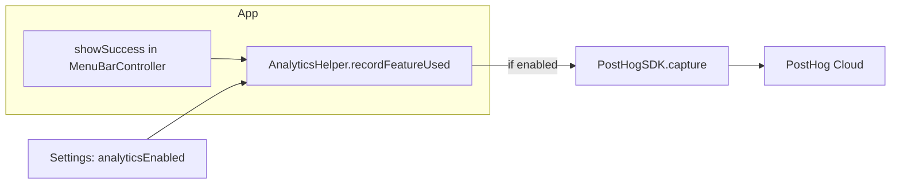

# PostHog Analytics Integration

## Goal

See which features users use (transcription, prompt mode, read aloud, prompt & read, live meeting, etc.) via anonymous events sent to PostHog. Free tier (1M events/month) is sufficient. Optional opt-out in Settings for trust.

---

## 1. Add PostHog dependency

- In Xcode: **File → Add Package Dependencies**, URL: `https://github.com/PostHog/posthog-ios.git`, version **3.0.0** or later.
- Add the **PostHog** product to the WhisperShortcut target (same pattern as existing WhisperKit / HotKey SPM dependencies in [WhisperShortcut.xcodeproj](WhisperShortcut.xcodeproj/project.pbxproj)).

---

## 2. Get PostHog API key and init at launch

- Create a project at [app.posthog.com](https://app.posthog.com) and copy the **Project API Key** (starts with `phc_`).
- Store the key in a config that is not committed (e.g. a short `PostHogConfig.swift` or a single constant in an existing config file, with the key in an `#if DEBUG` / non-DEBUG or env-based check so you can use a separate project for dev if desired). For simplicity, a compile-time constant in a single file is enough; document in README that the key must be added for release builds.
- In [FullApp.swift](WhisperShortcut/FullApp.swift), in `applicationDidFinishLaunching`, after existing setup and before the API-key check Task:
  - Import PostHog.
  - Call `PostHogSDK.shared.setup(PostHogConfig(apiKey: "<key>", host: "https://us.i.posthog.com"))`. Use EU host (`https://eu.i.posthog.com`) if you prefer EU-only data.
  - Optionally disable or use a dev project in DEBUG (e.g. only call `setup` when `!ProcessInfo.processInfo.isDebuggerAttached` or via a build flag) so dev usage does not pollute production analytics.

---

## 3. Analytics helper and UserDefaults key

- **New file** `WhisperShortcut/AnalyticsHelper.swift` (or `PostHogAnalytics.swift`):
  - Single responsibility: check “telemetry enabled” and send PostHog events.
  - Read a UserDefaults key (e.g. `UserDefaultsKeys.analyticsEnabled`). Default: `true`.
  - Expose a single method, e.g. `recordFeatureUsed(mode: FeatureMode)` where `FeatureMode` is an enum mapping to strings: `transcription`, `prompt`, `promptAndRead`, `readAloud`, `promptImprovement`, `liveMeeting`, `tts` (voice command). Optionally `settingsOpened`, `geminiChatMessageSent` for later.
  - Implementation: if `UserDefaults.standard.bool(forKey: UserDefaultsKeys.analyticsEnabled)` is true, call `PostHogSDK.shared.capture("feature_used", properties: ["mode": mode.rawValue])`. No PII, no transcript/clipboard content.
- Add in [UserDefaultsKeys.swift](WhisperShortcut/UserDefaultsKeys.swift) a new key, e.g. `static let analyticsEnabled = "analyticsEnabled"`.
- Set default in `applicationDidFinishLaunching`: if `UserDefaults.standard.object(forKey: UserDefaultsKeys.analyticsEnabled) == nil` then `set(true, forKey: UserDefaultsKeys.analyticsEnabled)` (same pattern as [FullApp.swift](WhisperShortcut/FullApp.swift) for `contextLoggingEnabled`).

---

## 4. Where to call the helper (feature_used)

Call `AnalyticsHelper.recordFeatureUsed(mode:)` only when a feature **completes successfully** (user sees success feedback). Do not send on every state change.

Relevant call sites in [MenuBarController.swift](WhisperShortcut/MenuBarController.swift) (and related flow) where success is shown:

- **Transcription**: When setting `self.appState = self.appState.showSuccess("Transcription copied to clipboard")` (and similar success for transcription) → `recordFeatureUsed(.transcription)`.
- **Prompt mode**: When showing success for AI response copied / prompt completed → `recordFeatureUsed(.prompt)`.
- **Prompt & Read**: When prompt-and-read flow completes with success (e.g. “AI response copied” or playback completed after that flow) → `recordFeatureUsed(.promptAndRead)`.
- **Read Aloud**: When showing “Playing audio...” or “Audio playback completed” for Read Aloud (not Prompt & Read) → `recordFeatureUsed(.readAloud)`.
- **Prompt improvement (voice)**: When improvement-from-voice flow succeeds → `recordFeatureUsed(.promptImprovement)`.
- **Live meeting**: When a live meeting session is stopped and final success is shown (if any) → `recordFeatureUsed(.liveMeeting)`.
- **TTS voice command**: When the “record voice command for TTS” flow completes successfully → `recordFeatureUsed(.tts)`.

Implementation approach: in each of these code paths, right before or after assigning `appState = appState.showSuccess(...)`, add one line: `AnalyticsHelper.recordFeatureUsed(.transcription)` (or the appropriate mode). The mode is known from the surrounding flow (which shortcut or handler ran). No change to `AppState` API.

Optional (can be a follow-up): when Settings window is shown, call `AnalyticsHelper.recordSettingsOpened()`; when user sends a message in Open Gemini Chat, call `AnalyticsHelper.recordGeminiChatMessageSent()`. Same pattern: helper checks `analyticsEnabled` and calls `PostHogSDK.shared.capture(...)`.

---

## 5. Settings UI for opt-out

- In [GeneralSettingsTab.swift](WhisperShortcut/Settings/Tabs/GeneralSettingsTab.swift), add a new section (e.g. “Privacy” or under “Support & Feedback”) with a single toggle:
  - Label: “Send anonymous usage statistics”
  - Subtitle: “Helps improve the app by understanding which features are used. No personal data is sent.”
  - Bind to `@AppStorage(UserDefaultsKeys.analyticsEnabled) private var analyticsEnabled = true`.
- Ensure the default is applied on first launch (step 3).

---

## 6. Privacy policy and App Privacy

- **[privacy.md](privacy.md)** and **[website/privacy.html](website/privacy.html)**:
  - Update the “Data Collection Summary” (or equivalent): change “No analytics or tracking” to something like “Optional anonymous usage statistics (can be disabled in Settings).”
  - Add a short section “Anonymous usage statistics”: we use PostHog to collect anonymized events (e.g. which feature was used); no personal data, no IP stored by PostHog (per their policy); data can be disabled in Settings. Link to PostHog privacy policy.
- **App Store Connect / App Privacy**: PostHog may collect product interaction data. Declare as needed (e.g. “Product Interaction”); refer to [PostHog docs](https://posthog.com/docs/libraries/ios) or their privacy manifest for exact labels.

---

## 7. What you get in PostHog

- Event “feature_used” with property “mode” (transcription, prompt, readAloud, etc.).
- Dashboards: counts, trends, breakdown by mode; optional funnels and retention.
- No PII; anonymous by design when you do not identify users.

---

## Files to add or touch (summary)

| Action            | File                                                                                                             |
| ----------------- | ---------------------------------------------------------------------------------------------------------------- |
| Add SPM package   | Xcode project                                                                                                    |
| Init PostHog      | [FullApp.swift](WhisperShortcut/FullApp.swift)                                                                   |
| New helper        | `WhisperShortcut/AnalyticsHelper.swift`                                                                          |
| New key + default | [UserDefaultsKeys.swift](WhisperShortcut/UserDefaultsKeys.swift), [FullApp.swift](WhisperShortcut/FullApp.swift) |
| Call helper       | [MenuBarController.swift](WhisperShortcut/MenuBarController.swift) (multiple success paths)                      |
| Toggle            | [GeneralSettingsTab.swift](WhisperShortcut/Settings/Tabs/GeneralSettingsTab.swift)                               |
| Privacy text      | [privacy.md](privacy.md), [website/privacy.html](website/privacy.html)                                           |

---

## Diagram

