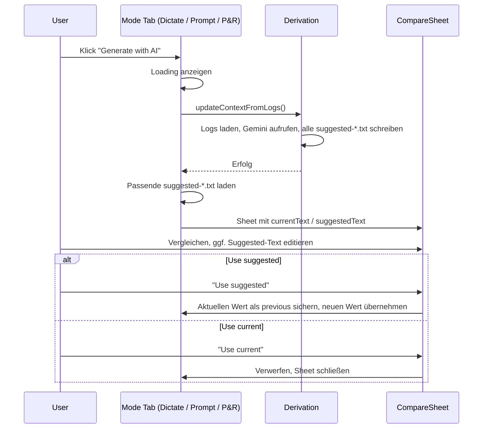

# User Context in General + „Generate with AI" in allen Modus-Tabs

## Ziele

1. **User Context in General**: Logging immer an (kein Toggle), „Context in Prompt"-Toggle und „Update Context"-Button in General-Tab.
2. **Dictate-Tab: Prompt + Difficult Words zusammenführen**: Die bisherige UX-Trennung in „Prompt" und „Difficult Words" aufheben → ein einziges System-Prompt-Feld. Das spiegelt die technische Realität wider (`buildDictationPrompt()` kombiniert ohnehin beides).
3. **„Generate with AI" in allen Modus-Tabs**: Konsistenter Button + Vergleichsfenster in Dictate, Prompt Mode und Prompt & Read.
4. **User-Context-Tab entfernen**: Alle Funktionen wandern in General bzw. die jeweiligen Modus-Tabs.

---

## 1. Interaction Logging immer an

- In [UserDefaultsKeys.swift](WhisperShortcut/UserDefaultsKeys.swift): Default für `userContextLoggingEnabled` auf `true` (falls noch nicht).
- Toggle zum Deaktivieren entfernen. Nirgends darf `userContextLoggingEnabled = false` gesetzt werden.
- In [GeneralSettingsTab.swift](WhisperShortcut/Settings/Tabs/GeneralSettingsTab.swift): Hinweistext statt Toggle: „Interaction logging is always on to improve AI suggestions."

---

## 2. User-Context-Einstellungen in General

In [GeneralSettingsTab.swift](WhisperShortcut/Settings/Tabs/GeneralSettingsTab.swift), neue Sektion **„User Context"**:

- Hinweis: Interaction Logging ist immer aktiv.
- **Toggle „Include user context in system prompt"** (Key: `userContextInPromptEnabled`).
- **Button „Update Context"** + Status-Text (ruft `UserContextDerivation().updateContextFromLogs()` auf). Aktualisiert user-context.md und zeigt Vergleichsfenster für User Context (Current vs. Suggested, editierbar, Use current / Use suggested).
- **„Delete Data"** und **„Open User Context Folder"** Buttons (bisher im User-Context-Tab).

---

## 3. Dictate-Tab: Prompt + Difficult Words zusammenführen

### Hintergrund

`SpeechService.buildDictationPrompt()` kombiniert `customPromptText` und `dictationDifficultWords` zu einem einzigen System Prompt. Die UI-Trennung in zwei Felder wird aufgehoben.

### Änderungen

- **[SpeechToTextSettingsTab.swift](WhisperShortcut/Settings/Tabs/SpeechToTextSettingsTab.swift)**:
  - `difficultWordsSection` entfernen.
  - `promptSection` bleibt als einziges System-Prompt-Feld.
  - Subtitle anpassen: Hinweis, dass der Prompt alles enthalten kann (Domain-Kontext, schwierige Wörter, Formatierungsregeln etc.).
- **[SpeechService.swift](WhisperShortcut/SpeechService.swift)**:
  - `buildDictationPrompt()` vereinfachen: Nur noch `customPromptText` zurückgeben, keine Kombination mit `dictationDifficultWords` mehr.
  - Die „Spelling reference"-Logik entfällt — der AI-generierte Prompt (oder der manuell geschriebene) enthält alles direkt.
- **[UserContextDerivation.swift](WhisperShortcut/UserContextDerivation.swift)**:
  - `suggested-dictation-prompt.txt` und `suggested-difficult-words.txt` zusammenführen zu **einem** Vorschlag: `suggested-dictation-prompt.txt`.
  - Der Gemini-Prompt für die Ableitung wird angepasst: Statt separater Difficult-Words-Liste soll ein vollständiger System Prompt generiert werden, der schwierige Wörter direkt integriert (z.B. als „Spelling reference"-Abschnitt im Prompt selbst).
  - `suggested-difficult-words.txt` wird nicht mehr generiert.
- **Migration**: Beim ersten Start nach dem Update: Wenn `dictationDifficultWords` nicht leer ist und `customPromptText` die Wörter noch nicht enthält → automatisch den bisherigen kombinierten Prompt (wie `buildDictationPrompt()` ihn erzeugt hätte) in `customPromptText` schreiben. So verliert kein Nutzer seine schwierigen Wörter.

---

## 4. „Generate with AI" — konsistent in allen drei Modus-Tabs

Gleicher Button und gleiches Vergleichsfenster in jedem Tab:

### 4.1 Dictate-Tab ([SpeechToTextSettingsTab.swift](WhisperShortcut/Settings/Tabs/SpeechToTextSettingsTab.swift))

- Button **„Generate with AI"** unter dem System-Prompt-Feld (nur sichtbar bei Gemini-Modell).
- Klick → Loading → `UserContextDerivation().updateContextFromLogs()` → `suggested-dictation-prompt.txt` laden → Vergleichsfenster öffnen.
- Current: aktueller `customPromptText`. Suggested: AI-Vorschlag (editierbar).
- „Use current" (verwerfen) / „Use suggested" (übernehmen, vorherigen Wert sichern).

### 4.2 Prompt Mode-Tab ([SpeechToPromptSettingsTab.swift](WhisperShortcut/Settings/Tabs/SpeechToPromptSettingsTab.swift))

- Button **„Generate with AI"** unter dem System-Prompt-Feld.
- Klick → Loading → `updateContextFromLogs()` → `suggested-prompt-mode-system-prompt.txt` laden → Vergleichsfenster.
- Current: aktueller `promptModeSystemPrompt`. Suggested: AI-Vorschlag.

### 4.3 Prompt & Read-Tab ([PromptAndReadSettingsTab.swift](WhisperShortcut/Settings/Tabs/PromptAndReadSettingsTab.swift))

- Button **„Generate with AI"** unter dem System-Prompt-Feld.
- Klick → Loading → `updateContextFromLogs()` → `suggested-prompt-and-read-system-prompt.txt` laden → Vergleichsfenster.
- Current: aktueller `promptAndReadSystemPrompt`. Suggested: AI-Vorschlag.

### 4.4 Wiederverwendbare Komponente

Neue View: `**CompareAndEditSuggestionView.swift**` unter `Settings/Components/`.

Parameter:

- `title: String` (z.B. „AI-Generated System Prompt")
- `currentText: String`
- `suggestedText: Binding<String>` (editierbar)
- `onUseCurrent: () -> Void`
- `onUseSuggested: (String) -> Void`
- `hasPrevious: Bool`
- `onRestorePrevious: (() -> Void)?`

Wird als Sheet präsentiert. Layout: zwei Spalten oder übereinander, „Current" (read-only) vs. „Suggested" (editierbar).

### 4.5 „Restore Previous"-Mechanismus

- Direkt vor „Use suggested" → aktuellen Wert in `previous*`-Key in UserDefaults sichern.
- Keys: `previousCustomPromptText`, `previousPromptModeSystemPrompt`, `previousPromptAndReadSystemPrompt`.
- „Restore Previous"-Button nur anzeigen wenn previous-Key existiert und sich vom aktuellen Wert unterscheidet.
- Maximal **eine** Vorgängerversion (kein History-Stack).

---

## 5. User-Context-Tab entfernen

- [SettingsConfiguration.swift](WhisperShortcut/Settings/Shared/SettingsConfiguration.swift): `userContext` aus Enum entfernen.
- [SettingsView.swift](WhisperShortcut/SettingsView.swift): Case entfernen.
- [UserContextSettingsTab.swift](WhisperShortcut/Settings/Tabs/UserContextSettingsTab.swift): Datei kann entfernt werden; relevante Logik (Apply/Restore, loadSuggestions) wird in die jeweiligen Tabs bzw. General übernommen.

Alle Funktionen haben ein neues Zuhause:

| Funktion                                  | Neuer Ort                                 |
| ----------------------------------------- | ----------------------------------------- |
| Interaction Logging Info                  | General                                   |
| Context-in-Prompt Toggle                  | General                                   |
| Update Context Button                     | General                                   |
| User Context (user-context.md) Suggestion | General (Vergleichsfenster)               |
| Delete Data / Open Folder                 | General                                   |
| Dictation Prompt Suggestion               | Dictate-Tab (Generate with AI)            |
| Difficult Words Suggestion                | Entfällt (in Dictation Prompt integriert) |
| Prompt Mode Suggestion                    | Prompt Mode-Tab (Generate with AI)        |
| Prompt & Read Suggestion                  | Prompt & Read-Tab (Generate with AI)      |

---

## 6. Ablauf „Generate with AI"

---

## 7. Wichtige Dateien

| Änderung                                                        | Datei                                                                                                                                                |
| --------------------------------------------------------------- | ---------------------------------------------------------------------------------------------------------------------------------------------------- |
| User-Context-Bereich (Logging, Toggle, Update, Delete, Folder)  | [GeneralSettingsTab.swift](WhisperShortcut/Settings/Tabs/GeneralSettingsTab.swift)                                                                   |
| Prompt + Difficult Words zusammenführen, „Generate with AI"     | [SpeechToTextSettingsTab.swift](WhisperShortcut/Settings/Tabs/SpeechToTextSettingsTab.swift)                                                         |
| „Generate with AI" für Prompt Mode                              | [SpeechToPromptSettingsTab.swift](WhisperShortcut/Settings/Tabs/SpeechToPromptSettingsTab.swift)                                                     |
| „Generate with AI" für Prompt & Read                            | [PromptAndReadSettingsTab.swift](WhisperShortcut/Settings/Tabs/PromptAndReadSettingsTab.swift)                                                       |
| `buildDictationPrompt()` vereinfachen                           | [SpeechService.swift](WhisperShortcut/SpeechService.swift)                                                                                           |
| Ableitung: ein kombinierter Dictation-Prompt statt zwei Dateien | [UserContextDerivation.swift](WhisperShortcut/UserContextDerivation.swift)                                                                           |
| Wiederverwendbare Vergleichs-View                               | Neue: `CompareAndEditSuggestionView.swift` unter Settings/Components                                                                                 |
| User-Context-Tab entfernen                                      | [SettingsConfiguration.swift](WhisperShortcut/Settings/Shared/SettingsConfiguration.swift), [SettingsView.swift](WhisperShortcut/SettingsView.swift) |
| Migration Difficult Words → Prompt                              | ggf. in App-Start oder SettingsViewModel                                                                                                             |

---

## 8. Implementierungsreihenfolge

1. **Migration + buildDictationPrompt vereinfachen** — Damit nichts kaputt geht: zuerst Difficult Words in den Prompt migrieren und `buildDictationPrompt()` anpassen.
2. **CompareAndEditSuggestionView** — Wiederverwendbare Komponente bauen.
3. **UserContextDerivation anpassen** — Einen kombinierten Dictation-Prompt generieren statt zwei Dateien.
4. **Dictate-Tab** — Difficult Words-Sektion entfernen, „Generate with AI" + Vergleichsfenster einbauen.
5. **Prompt Mode-Tab** — „Generate with AI" + Vergleichsfenster einbauen.
6. **Prompt & Read-Tab** — „Generate with AI" + Vergleichsfenster einbauen.
7. **General-Tab** — User-Context-Bereich (Logging-Info, Toggle, Update Context mit Vergleichsfenster für user-context.md, Delete Data, Open Folder).
8. **User-Context-Tab entfernen** — Enum, SettingsView, Datei.
