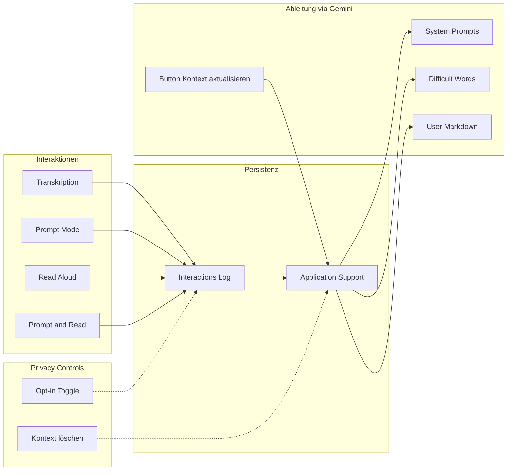

# User-Context-Persistenz und kontextabhängige Anpassung

## Ziel

- **Schritt 1 (Persistenz + Ableitung):** Alle relevanten Interaktionen in JSONL-Dateien persistieren UND per manuellem Trigger „Kontext aktualisieren" daraus System-Prompt, Difficult Words und user-context.md via Gemini ableiten. Beide Teile werden zusammen released, damit das Feature ab Tag 1 Nutzer-Mehrwert hat.
- **Schritt 2 (Kontext-Nutzung):** user-context.md automatisch in den System-Prompt des Prompt-Modus einbinden (per Toggle steuerbar).

## Architektur-Überblick



## 1. Persistenz-Layer

**Speicherort:** `~/Library/Application Support/WhisperShortcut/UserContext/` (analog zu [ModelManager.swift](WhisperShortcut/ModelManager.swift) und [DebugLogger](WhisperShortcut/DebugLogger.swift)).

### Opt-in & Privacy

- **Logging ist standardmäßig deaktiviert.** Neuer UserDefaults-Key `userContextLoggingEnabled` (Bool, default `false`). Der Nutzer aktiviert das Logging explizit in den Einstellungen.
- **„Kontext löschen"-Button** in den Einstellungen: Löscht alle `interactions-*.jsonl` sowie die abgeleiteten Dateien (`user-context.md`, `suggested-*.txt`) aus `UserContext/`. Bestätigungsdialog vorschalten.
- Logging nur wenn `userContextLoggingEnabled == true`; sonst sind alle `UserContextLogger`-Aufrufe No-Ops.

### Neuer Service: `UserContextLogger` (Singleton)

- Verzeichnis bei Bedarf anlegen.
- Pro Interaktion **eine Zeile** in eine **append-only-Datei** schreiben (parsbar für Ableitung).
- **Prüft `userContextLoggingEnabled**` vor jedem Schreibvorgang.

**Format:** JSON Lines (`.jsonl`) pro Tag, z.B. `interactions-2026-02-09.jsonl`. Jede Zeile ein JSON-Objekt mit:

- `ts` (ISO8601), `mode` (transcription | prompt | promptAndRead | readAloud), `model` (optional)
- Bei **transcription:** `result` (vollständiger Transkripttext).
- Bei **prompt** / **promptAndRead:** `selectedText`, `userInstruction`, `modelResponse` (alle vollständig).
- Bei **readAloud:** `text` (eingelesener Text), optional `voice`.

Vorteil: einfach zu parsen, tagesweise rotierbar, keine riesigen Einzeldateien.

### Automatische Rotation

- JSONL-Dateien älter als **90 Tage** werden beim App-Start automatisch gelöscht (Housekeeping in `UserContextLogger.init` oder `didFinishLaunching`). Verhindert unbegrenztes Wachstum.

### Zu loggende Stellen

| Aktion         | Wo                                                                                                                                                                                                                                                                                                                                       | Daten                                                                   |
| -------------- | ---------------------------------------------------------------------------------------------------------------------------------------------------------------------------------------------------------------------------------------------------------------------------------------------------------------------------------------- | ----------------------------------------------------------------------- |
| Transkription  | Nach Erfolg in [MenuBarController.performTranscription](WhisperShortcut/MenuBarController.swift) (oder nach `speechService.transcribe`)                                                                                                                                                                                                  | mode=transcription, result, modelInfo                                   |
| Prompt (Voice) | In [SpeechService](WhisperShortcut/SpeechService.swift) direkt nach `PromptConversationHistory.shared.append` (Zeile 426–431 und 619–624) – dort sind selectedText, userInstruction, modelResponse bereits vorhanden                                                                                                                     | mode=prompt/promptAndRead, selectedText, userInstruction, modelResponse |
| Prompt (Text)  | Gleich oben, `executePromptWithText` ruft dieselbe `append`-Logik nicht auf? Prüfen: [SpeechService 619–624](WhisperShortcut/SpeechService.swift) – append wird in executePromptWithText aufgerufen. Also Persistenz einmal zentral nach `append()` in PromptConversationHistory ergänzen (oder in beiden Aufrufern mit gleichen Daten). | wie oben                                                                |
| Read Aloud     | Nach Erfolg in [MenuBarController](WhisperShortcut/MenuBarController.swift) (z.B. Stellen wo `readTextAloud` erfolgreich zurückkehrt, ~732, 790, 830)                                                                                                                                                                                    | mode=readAloud, text, voice                                             |
| Prompt & Read  | Bereits als Prompt-Turn in History; zusätzlich könnte man einen Eintrag „promptAndRead" inkl. TTS-Text markieren. Ein Eintrag mit mode=promptAndRead reicht, wenn dieselbe append-Stelle genutzt wird.                                                                                                                                   | wie prompt, mode=promptAndRead                                          |

**Live Meeting:** Bereits in `~/Documents/WhisperShortcut/` gespeichert. Optional: zusätzlich einen Verweis oder Metadaten (Dateipfad, Session-Start) in die Interaction-Log-Zeile schreiben; nicht zwingend für Phase 1.

### Implementierung

- Neue Datei `UserContextLogger.swift`: Methoden wie `logTranscription(result:model:)`, `logPrompt(mode:selectedText:userInstruction:modelResponse:)`, `logReadAloud(text:voice:)`. Intern: Datum ermitteln, Dateiname `interactions-<date>.jsonl`, Zeile anhängen (Thread-sicher: serial queue). Prüft `userContextLoggingEnabled` als Guard.
- [SpeechService](WhisperShortcut/SpeechService.swift): Nach jedem `PromptConversationHistory.shared.append(...)` zusätzlich `UserContextLogger.shared.logPrompt(...)` aufrufen (für Voice- und Text-Prompt gleichermaßen).
- [MenuBarController](WhisperShortcut/MenuBarController.swift): Nach erfolgreicher Transkription `UserContextLogger.shared.logTranscription(...)`; nach erfolgreichem Read Aloud (alle drei Stellen) `UserContextLogger.shared.logReadAloud(...)`.

---

## 2. Ableitung: „Kontext aktualisieren" (via Gemini)

**Trigger:** Einstellungen-UI: neuer Bereich „User Context" mit Button **„Kontext aktualisieren"**. Eigener Tab oder Unterbereich in [SettingsView](WhisperShortcut/SettingsView.swift).

**Voraussetzung:** Gemini API-Key muss konfiguriert sein. Button ist disabled ohne Key (mit Hinweistext). Ableitung ohne API bringt zu wenig Mehrwert — Gemini ist der Standardpfad.

### Token-Budget-Strategie

Die Aggregation muss die Datenmenge für den Gemini-Aufruf begrenzen:

1. **Zeitfenster:** Nur die letzten **30 Tage** einlesen (konfigurierbar).
2. **Sampling pro Modus:** Maximal **50 Einträge pro Modus** (transcription, prompt, readAloud). Bei mehr Einträgen: gleichmäßig über den Zeitraum samplen (z.B. jeden N-ten Eintrag).
3. **Text-Truncation:** Einzelne Felder (`result`, `selectedText`, `modelResponse`) auf max. **2000 Zeichen** kürzen.
4. **Gesamt-Budget:** Der aggregierte Text für den Gemini-Aufruf darf **100.000 Zeichen** nicht überschreiten. Falls überschritten: älteste Einträge zuerst entfernen.

### Ablauf beim Klick

1. **Logs lesen:** Alle `interactions-*.jsonl` der letzten 30 Tage aus `UserContext/` einlesen, parsen.
2. **Aggregation mit Token-Budget:** Sampling und Truncation wie oben anwenden.
3. **Gemini-Aufruf:** Einmaliger Aufruf mit aggregierten Texten:

  > „Analysiere die folgenden Nutzer-Interaktionen und erzeuge:
  > (1) user-context.md — ein strukturiertes Nutzerprofil (typische Aufgaben, Sprache, Stil, Präferenzen, häufige Themen),
  > (2) einen vorgeschlagenen System-Prompt für den Prompt-Modus (optimiert auf die erkannten Aufgaben des Nutzers),
  > (3) eine Liste schwieriger/fachspezifischer Wörter für die Diktat-Erkennung."
1. **Ausgabe (alles in `UserContext/`):**

- `user-context.md` — Nutzerprofil
- `suggested-prompt-mode-system-prompt.txt` (und ggf. `suggested-prompt-and-read-system-prompt.txt`)
- `suggested-difficult-words.txt` (eine pro Zeile)

### „Vorschläge übernehmen"

In den Einstellungen: Buttons „Vorgeschlagenen System-Prompt übernehmen" und „Vorgeschlagene schwierige Wörter übernehmen", die den Inhalt der jeweiligen Datei in die entsprechenden UserDefaults schreiben (`promptModeSystemPrompt`, `dictationDifficultWords`). Vor dem Übernehmen wird der aktuelle Wert angezeigt (Diff-Ansicht oder Vorher/Nachher).

### Implementierung

- Neue Datei `UserContextDerivation.swift`: Methode `updateContextFromLogs()`. Liest JSONL, aggregiert mit Token-Budget, ruft Gemini auf, schreibt die drei Artefakte.
- Settings: neuer Bereich „User Context" mit:
  - Toggle „Interaktionen aufzeichnen" (`userContextLoggingEnabled`)
  - Button „Kontext aktualisieren" (disabled ohne API-Key, mit Spinner während Verarbeitung)
  - Button „Kontext löschen" (mit Bestätigungsdialog)
  - Bereich „Vorschläge" mit Übernehmen-Buttons (sichtbar nur wenn Vorschlagsdateien existieren)
  - Toggle „User-Kontext im Prompt-Modus verwenden" (`userContextInPromptEnabled`, default `true`)

---

## 3. Nutzung des Kontexts beim Prompt-Modus

Beim Aufbau des **System-Prompts** für [executePromptWithGemini](WhisperShortcut/SpeechService.swift) / [executePromptWithText](WhisperShortcut/SpeechService.swift):

- **Nur wenn** `userContextInPromptEnabled == true` (neuer UserDefaults-Key, default `true`).
- Wenn `UserContext/user-context.md` existiert, Inhalt lesen und an `systemPrompt` anhängen:

  ```
  \n\n---\nUser context:\n<Inhalt von user-context.md>
  ```

- **Längenlimit:** Maximal die letzten **3000 Zeichen** der Datei einbinden, um den System-Prompt nicht zu überladen.

### Änderungen

- In [SpeechService](WhisperShortcut/SpeechService.swift), wo `systemPrompt` für Prompt-Modus gebaut wird (Zeilen 306–319 und 519–522): Nach dem Setzen von `systemPrompt` prüfen, ob Toggle aktiv und Datei vorhanden; falls ja, Inhalt (gekürzt) anhängen.
- Neuer Helfer `UserContextLoader` (oder Methode in `UserContextLogger`): `loadUserContext() -> String?` — liest `user-context.md`, kürzt auf 3000 Zeichen, gibt `nil` zurück wenn Datei nicht existiert oder Toggle deaktiviert.

---

## 4. Dateien und Änderungen (Kurzüberblick)

| Aktion   | Datei / Ort                                                                                                                                                                      |
| -------- | -------------------------------------------------------------------------------------------------------------------------------------------------------------------------------- |
| Neu      | `UserContextLogger.swift` — Logging in JSONL, Rotation, Opt-in-Guard, Löschfunktion                                                                                              |
| Neu      | `UserContextDerivation.swift` — Logs lesen, Token-Budget, Gemini-Aufruf, Artefakte schreiben                                                                                     |
| Anpassen | [SpeechService.swift](WhisperShortcut/SpeechService.swift) — nach append() UserContextLogger aufrufen; beim Bau des System-Prompts user-context.md einbinden (wenn Toggle aktiv) |
| Anpassen | [MenuBarController.swift](WhisperShortcut/MenuBarController.swift) — nach Transkription und nach Read Aloud UserContextLogger aufrufen                                           |
| Anpassen | Settings — neuer Bereich „User Context" mit Toggles, Buttons, Vorschläge-Bereich                                                                                                 |
| Anpassen | [UserDefaultsKeys](WhisperShortcut/UserDefaultsKeys.swift) — neue Keys: `userContextLoggingEnabled`, `userContextInPromptEnabled`                                                |

---

## 5. Privacy & Hinweise

- **Opt-in:** Logging ist standardmäßig deaktiviert. Nutzer muss explizit aktivieren.
- **Löschfunktion:** „Kontext löschen"-Button entfernt alle JSONL-Dateien und abgeleitete Artefakte. Bestätigungsdialog.
- **Rotation:** JSONL-Dateien älter als 90 Tage werden automatisch gelöscht.
- **Datenweitergabe:** Beim „Kontext aktualisieren" werden aggregierte (gesamplete, gekürzte) Interaktionsdaten an Gemini gesendet. Klarer Hinweis in der UI: „Ihre Interaktionsdaten werden zur Analyse an Google Gemini gesendet."
- In [privacy.md](privacy.md) ergänzen: Neue Kategorie „User Context / Interaction Logs" — Speicherort, Opt-in-Mechanismus, Datenweitergabe an Gemini bei Ableitung, Löschmöglichkeit.
- Sandbox: Schreiben in Application Support ist üblich; prüfen ob [WhisperShortcut.entitlements](WhisperShortcut/WhisperShortcut.entitlements) Lesezugriff auf das eigene App-Support-Verzeichnis abdeckt (normalerweise ja).

---

## 6. Reihenfolge der Umsetzung

1. **UserDefaultsKeys** erweitern: `userContextLoggingEnabled`, `userContextInPromptEnabled`.
2. **UserContextLogger** implementieren: JSONL-Format, Opt-in-Guard, serial queue, Rotation, Löschfunktion.
3. **Anbindung:** SpeechService (nach append), MenuBarController (Transkription, Read Aloud) — alle Interaktionen schreiben.
4. **UserContextDerivation:** Token-Budget-Strategie, Gemini-Aufruf, Artefakte schreiben.
5. **Settings-UI:** „User Context"-Bereich mit Toggles, Buttons, Vorschläge-Anzeige.
6. **Kontext im Prompt:** user-context.md beim Bau des System-Prompts in SpeechService einbinden (UserContextLoader, Toggle-Guard).
7. **Dokumentation:** privacy.md aktualisieren.

Schritte 1–5 werden zusammen released, damit das Feature ab Tag 1 vollständig nutzbar ist.
