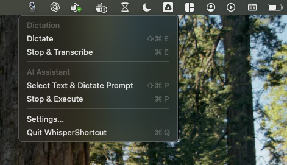

# 🎙️ WhisperShortcut

Simple macOS menu bar app for speech-to-text using OpenAI Whisper and Shortcuts.



📹 **[Watch Demo Video](https://youtu.be/alx7H9NilJ4)**

## 🚀 Quick Start

### Build from Source (Recommended)

```bash
git clone https://github.com/mgsgde/WhisperShortcut.git
cd WhisperShortcut
./install.sh
```

This will build the app and install it to `/Applications/`.

### Configure API Key

- Right-click the 🎙️ menu bar icon
- Select "Settings..."
- Enter your OpenAI API key
- Click "Save"

### Start Recording

- Press `⌘⌥R` (or your configured shortcut) to start recording
- Press `⌘R` (or your configured shortcut) to stop and transcribe
- The transcribed text is automatically copied to your clipboard

## 🔧 Requirements

- **macOS**: 15.5 (Sequoia) or later
- **OpenAI API Key**: Required for transcription services
- **Microphone Access**: Required for audio recording

## 🏗️ Development

### Prerequisites

- Xcode 15.0 or later
- macOS 15.5 or later
- Swift 5.9 or later

### Building from Source

1. **Clone the repository**

   ```bash
   git clone https://github.com/mgsgde/WhisperShortcut.git
   cd WhisperShortcut
   ```

2. **Open in Xcode**

   ```bash
   open WhisperShortcut.xcodeproj
   ```

**Important**: If you're developing this project yourself, make sure to change the Team ID and Company Name in the project settings to match your own Apple Developer account
