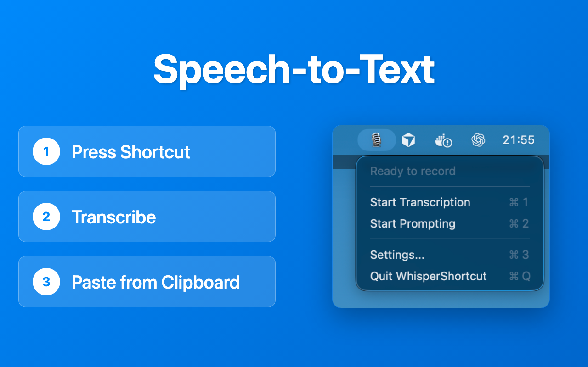

# WhisperShortcut

**Speech-to-Text** and **Voice-to-Prompt** shortcut for macOS with **Google Gemini** and **Offline Whisper** support

<div align="center">
  
</div>

📺 **[Watch Demo Video](https://youtu.be/yz8cbaI6NYQ)**

## Download & Support

**[Download for FREE via GitHub Releases](https://github.com/mgsgde/whisper-shortcut/releases)**

### Support the Project ❤️

WhisperShortcut is open source and free to use. If you want to support the development, you can purchase the app on the App Store:

**[Buy on Mac App Store](https://apps.apple.com/us/app/whispershortcut/id6749648401)**

This is **completely optional**. If you like the app, a purchase or a review on the App Store is a fantastic way to say thank you! ⭐

## How it works

### Transcription Mode (Speech-to-Text)

Choose between **cloud** (Google Gemini) or **offline** (Whisper) transcription:

1. **Setup** - For cloud transcription: Configure your Gemini API key [here](https://aistudio.google.com/app/apikey). For offline transcription: Download a Whisper model in Settings (no API key needed).
2. **Press Shortcut** - Start recording with a keyboard shortcut
3. **Transcribe** - Uses your selected model (Gemini or Whisper) for accurate speech-to-text
4. **Copy to Clipboard** - Automatically copies transcription to your clipboard

### Prompt Mode (Voice-to-Prompt)

Speak instructions that apply to selected clipboard text:

1. **Select Text** - Copy text you want to modify to your clipboard
2. **Press Shortcut** - Start recording your voice instruction
3. **Process** - Gemini processes both your voice instruction and the selected text
4. **Get Result** - Modified text is automatically copied to your clipboard

## Installation

### Recommended: Download App

1. Download the latest `.dmg` file from the [Releases page](https://github.com/mgsgde/whisper-shortcut/releases).
2. Open the DMG and drag `WhisperShortcut` to your Applications folder.

### Build from Source

```bash
# Clone the repository
git clone https://github.com/mgsgde/whisper-shortcut.git
cd whisper-shortcut

# Install the app
bash install.sh
```

## Features

- **Speech-to-Text Transcription**: Audio → Text transcription using Google Gemini (cloud) or Whisper (offline)
- **Voice-to-Prompt Mode**: Speak instructions to modify selected clipboard text using Gemini AI
- **Offline Support (Privacy Mode)**: Use local Whisper models for completely offline transcription
- **Smart Clipboard Integration**: Automatic copy to clipboard for both modes
- **Customizable Shortcuts**: Configurable keyboard shortcuts for each mode
  
## Development

### Prerequisites

- macOS 15.5+
- Xcode 16.0+
- Gemini API key (required only for cloud transcription and prompt mode; optional for offline Whisper transcription)

### Open in Xcode

```bash
git clone https://github.com/mgsgde/whisper-shortcut.git
cd whisper-shortcut
open WhisperShortcut.xcodeproj
```

### Release Process

To create a new release:

1. Update the version number in Xcode (`Target > General > Version`).
2. Run the release helper script:

   ```bash
   scripts/create-release.sh
   ```

   This will tag the commit and trigger the GitHub Action to build and release the app.

## License

MIT License - see [LICENSE](LICENSE) file for details.

---

Made with ❤️ in Karlsruhe, Germany
