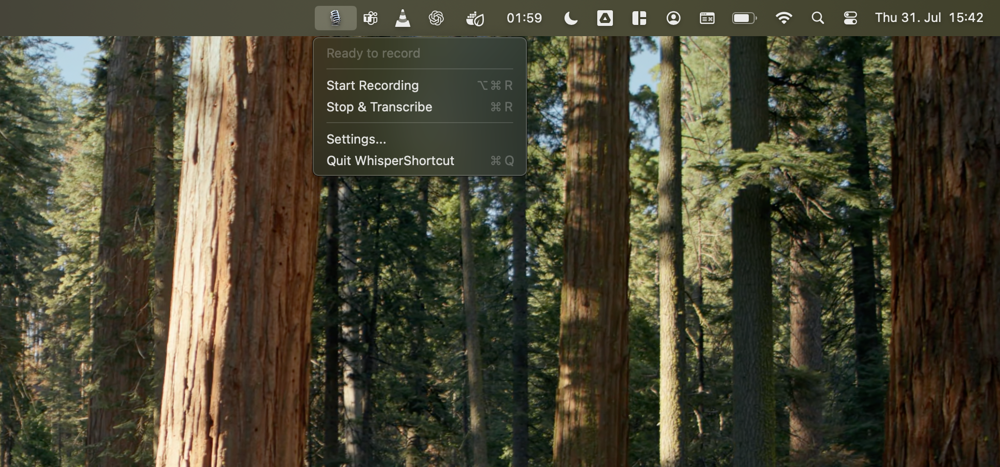

# 🎙️ WhisperShortcut

Simple macOS menu bar app for speech-to-text using OpenAI Whisper and Shortcuts.



## Security

API keys are securely stored in the macOS Keychain with encrypted storage and access control. Keys are only accessible when the device is unlocked and are stored locally (no iCloud sync).

## Quick Start

### Development Mode (Local)

```bash
./dev.sh
```

### Install to Applications

```bash
./install.sh
```

## Setup

1. Right-click 🎙️ icon → Settings → Add your OpenAI API key
2. Grant microphone permission when prompted  
3. Use shortcuts: **⌘⌥R** (start), **⌘R** (stop & transcribe)

Text gets copied to clipboard automatically. Done! 🎉

## Development

### Running Tests

```bash
cd WhisperShortcut
./test.sh                    # Run unit tests only
./test.sh --integration      # Run all tests including integration tests
```

**Integration Tests**: For tests that make real API calls, copy `test-config.example` to `test-config` and add your OpenAI API key:

```bash
cp test-config.example test-config
# Edit test-config and add your API key
```

### Scripts Available

- `./dev.sh` - Build and run the app locally for development
- `./install.sh` - Build and install the app to Applications folder  
- `./test.sh` - Clean, build, and run all Swift tests

### Project Structure

- `Sources/` - Swift source code
  - `FullApp.swift` - Main application entry point
  - `MenuBarController.swift` - Menu bar interface and controls
  - `AudioRecorder.swift` - Audio recording functionality
  - `TranscriptionService.swift` - OpenAI Whisper API integration
  - `ClipboardManager.swift` - Clipboard operations and text formatting
  - `SettingsWindow.swift` - Settings UI and API key management
  - `SimpleShortcuts.swift` - Keyboard shortcut handling
- `Tests/` - Unit tests for core functionality
