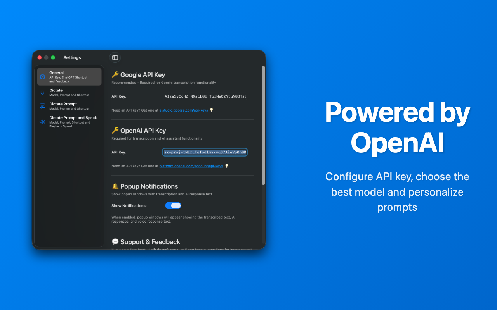

# WhisperShortcut

**Speech-to-text** shortcut with **OpenAI Whisper API** and **Google Gemini**

<div align="center">
  
  
  
</div>

📺 **[Watch Demo Video](https://youtu.be/yz8cbaI6NYQ)**

## Support the Project  

**[Buy on Mac App Store](https://apps.apple.com/us/app/whispershortcut/id6749648401)**  

If you like WhisperShortcut, please leave a review or buy it on the App Store to support the project! ⭐ It’s optional — you can also install it for free yourself.

## How it works

### Transcription Mode

1. **Setup** - Configure your API key (OpenAI API key [here](https://platform.openai.com/account/api-keys) or Gemini API key [here](https://aistudio.google.com/app/apikey))
2. **Press Shortcut** - Start recording with a keyboard shortcut
3. **Transcribe** - Uses OpenAI's Whisper API or Google Gemini for accurate speech-to-text
4. **Paste from Clipboard** - Automatically copies transcription to your clipboard

### Prompt Mode (NEW!)

1. **Select Text** - Mark any text you want to use as context
2. **Press Prompt Shortcut** - Automatically captures selected text and starts recording
3. **Speak Your Prompt** - Ask GPT-Audio or Gemini to analyze, explain, or work with the selected text
4. **Get Smart Response** - GPT-Audio or Gemini receives both your spoken prompt AND the selected text as context

**💡 Pro Tip:** If automatic text capture doesn't work (especially in App Store version), manually press **⌘C** to copy your selected text before using the prompt shortcut.

## Get WhisperShortcut

### Free Installation

```bash
# Clone the repository
git clone https://github.com/mgsgde/whisper-shortcut.git
cd whisper-shortcut

# Install the app
bash install.sh
```

## Installation

```bash
# Clone the repository
git clone https://github.com/mgsgde/whisper-shortcut.git
cd whisper-shortcut

# Install the app
bash install.sh
```

## Features

- **Dual Recording Modes**:
  - **Transcription Mode**: Audio → Text transcription using OpenAI Whisper API (GPT-4o-transcribe) or Google Gemini models
  - **Prompt Mode**: Audio → Prompt execution using GPT-Audio or Gemini models with **automatic clipboard context**
- **Smart Clipboard Integration**:
  - **Transcription Mode**: Automatic copy to clipboard
  - **Prompt Mode**: Automatically captures selected text and includes it as context
- **Customizable Shortcuts**: Configurable keyboard shortcuts for both modes
- **Context-Aware Prompts**: When using Prompt Mode, the app automatically simulates Cmd+C to capture any selected text and includes it as context for GPT-Audio or Gemini models
  
## Development

### Prerequisites

- macOS 15.5+
- Xcode 16.0+
- OpenAI API key or Gemini API key

### Open in Xcode

```bash
git clone https://github.com/mgsgde/whisper-shortcut.git
cd whisper-shortcut
open WhisperShortcut.xcodeproj
```

## License

MIT License - see [LICENSE](LICENSE) file for details.

---

Made with ❤️ in Karlsruhe, Germany
