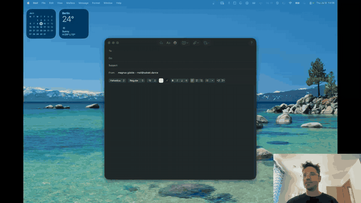

# WhisperShortcut

**Voice-first AI for your Mac.** Press ⌘1 anywhere, speak, and the transcription lands on your clipboard — ready to paste into any app. Speak an instruction (⌘2) to rewrite whatever you copied, have any selected text read aloud (⌘4), or open an AI chat that works with your Calendar, Gmail, Tasks, and Trello (⌥Space).

Bring your own API keys — Gemini, and optionally GPT or Grok — or run fully offline with local Whisper. No account, no subscription, no backend. Open source (AGPL-3.0).



▶️ [Watch the full demo on YouTube](https://www.youtube.com/watch?v=JTa4APF72cY) · Website: [whispershortcut.com](https://whispershortcut.com)

## Download

**[⬇️ Get WhisperShortcut on the Mac App Store](https://apps.apple.com/us/app/whispershortcut/id6749648401)** — the easiest way to install, with automatic updates.

- Prefer a direct download? Get the latest signed `.dmg` from [GitHub Releases](https://github.com/mgsgde/whisper-shortcut/releases).
- Cloud features use your Google Gemini API key and, optionally, an xAI API key (Grok chat and TTS) or an OpenAI API key (GPT-5.x chat, transcription, GPT Audio Dictate Prompt, TTS). Offline Whisper needs no key at all.

## Features

- **Dictate**: Record speech and copy the transcription to your clipboard. Use Gemini or OpenAI cloud models, a self-hosted transcription endpoint, or local Whisper models offline. Long recordings are split into chunks and processed in parallel.
- **Dictate Prompt**: Speak an instruction that edits the current clipboard text, for example "make this shorter" or "translate this to English". Supports Gemini and OpenAI audio-input models; optional screenshots can be included with the prompt.
- **Read Aloud**: Press the shortcut on any selected text to copy it and read it aloud with Gemini, OpenAI, or xAI TTS voices. An optional Smart Rewrite pass cleans up code or markdown before TTS, and playback speed is configurable.
- **Screenshot**: Capture the screen from the menu bar and optionally attach it to Dictate Prompt or chat, or save captures to a folder.
- **Chat**: Use a persisted multi-session chat window with Gemini, Grok, or OpenAI models, screenshots, image attachments, slash commands, optional web grounding, and per-session reasoning depth.
- **Google integrations**: Connect a Google account so chat can work with Calendar, Tasks, and Gmail through controlled local tools.
- **Trello integration**: Connect Trello so chat can list boards, lists, and cards and create, move, update, or archive cards.
- **Live Meeting**: Record meetings in chunks, transcribe them as they complete, keep an in-app transcript, and save meeting files locally.
- **Smart Improvement**: Let the app improve system prompts, user context, and the Whisper glossary from usage logs or a spoken instruction.

## Requirements

- macOS 15.5 or later
- Xcode 16.0 or later for development
- Google Gemini API key for cloud transcription, Dictate Prompt, chat, TTS, Smart Improvement, and live meetings
- Optional xAI API key for Grok chat models and Grok Voice TTS
- Optional OpenAI API key for GPT-5.x chat, OpenAI transcription (GPT-4o Transcribe), GPT Audio Dictate Prompt, and GPT-4o mini TTS
- Optional Google account connection for Calendar, Tasks, and Gmail tools
- Optional Trello Power-Up API key and token for board, list, and card tools

Offline Whisper dictation works without an API key after downloading a local model in Settings.

## Installation

1. Download the latest `.dmg` from [Releases](https://github.com/mgsgde/whisper-shortcut/releases).
2. Open the DMG and drag `WhisperShortcut.app` into `/Applications`.
3. Start WhisperShortcut from Applications.
4. Open Settings from the menu bar app and add your Google Gemini API key if you want cloud features.
5. Grant microphone and accessibility permissions when macOS asks.

## Common Workflows

Default menu bar shortcuts (all configurable in Settings → General):

| Action | Default shortcut |
| --- | --- |
| Dictate | ⌘1 |
| Dictate Prompt | ⌘2 |
| Screenshot | ⌘3 |
| Read Aloud | ⌘4 |
| Chat | ⌥Space |
| Settings | ⌘0 |

Press **Stop** in the menu bar (or use the active mode's shortcut again) to cancel recording, TTS playback, or in-flight processing.

### Dictation

1. Configure a Dictate shortcut in Settings → Dictate.
2. Choose a Gemini, OpenAI, self-hosted, or Whisper transcription model.
3. Press the shortcut, speak, then stop recording.
4. The transcription is copied to the clipboard and can optionally be pasted automatically.

### Dictate Prompt

1. Copy text you want to edit.
2. Press the Dictate Prompt shortcut.
3. Speak an instruction, such as "turn this into bullet points".
4. The edited result is copied to the clipboard.

Optional: capture a screenshot (⌘3 or chat `/screenshot`) before or during the prompt when screenshot-in-prompt mode is enabled.

### Read Aloud

1. Select text in any app.
2. Press the Read Aloud shortcut.
3. The selection is copied and read aloud with your chosen TTS model and voice.

Use Settings → Read Aloud to pick the TTS provider, voice, Smart Rewrite, and playback speed. Chat replies can also be read aloud from the message actions.

### Screenshot

Press the Screenshot shortcut to capture the screen. Captures can be attached to the next Dictate Prompt or chat message, or saved to a folder when that option is enabled in Settings → Screenshot.

### Chat

Open the chat window from the menu bar or its configured shortcut. Chat sessions are stored locally.

Core slash commands:

- `/new` — start a new chat
- `/screenshot` — attach a screenshot to your next message
- `/attach` — open the file picker for PDFs, images, or text
- `/model` — switch model (e.g. `/model 3.5 flash`)
- `/think` — set reasoning depth for this chat (`minimal`, `low`, `medium`, `high`, or `default`)
- `/settings` — open Settings
- `/pin` / `/unpin` — keep the window open or close on focus loss
- `/meeting` — start or stop live meeting recording
- `/copy` — copy the chat history as Markdown

Model shortcuts include `/gemini`, `/grok`, `/gpt`, `/openai`, and per-model aliases such as `/gemini35flash`. Gemini models use your Google API key, Grok models use your xAI API key, and OpenAI models use your OpenAI API key.

Connect Google or Trello in Settings → Chat to unlock the corresponding chat tools.

### Live Meeting

Type `/meeting` in chat to start and stop live meeting recording. Audio is rotated into chunks, transcribed, and appended to the meeting transcript. Saved transcripts live in the app's Application Support folder.

### Smart Improvement

In Settings → General, enable **Save usage data** if you want the app to learn from your interactions. Then use **Improve from usage** or **Generate with AI** to review suggested updates to system prompts, user context, or the Whisper glossary before accepting them.

## Build From Source

```bash
git clone https://github.com/mgsgde/whisper-shortcut.git
cd whisper-shortcut
bash install.sh
```

For development, build and restart the app with:

```bash
bash scripts/rebuild-and-restart.sh
```

Useful scripts:

- `scripts/rebuild-and-restart.sh`: Build Debug, sync bundled docs, and restart the local app.
- `scripts/logs.sh`: Stream or filter app logs.
- `scripts/create-release.sh`: Create a tagged release.
- `scripts/test-gemini-models.sh`, `scripts/test-grok-models.sh`, `scripts/test-openai-models.sh`: Check provider model availability and basic responses.

## Project Structure

- `WhisperShortcut/`: Swift source for the macOS app.
- `WhisperShortcut/Docs/`: User-facing markdown bundled with the app (mirrored from the repo README and data-directory docs on rebuild).
- `WhisperShortcut.xcodeproj/`: Xcode project and shared schemes.
- `scripts/`: Local development and release helper scripts.
- `.github/workflows/release.yml`: GitHub Actions workflow for signed, notarized release builds.
- `plans/`: Shared implementation plans and specs.
- `.cursor/`: Cursor agent commands, skills, and rules (see `.cursor/commands/README.md`).

Core files:

- `AppState.swift`: Central app state machine.
- `MenuBarController.swift`: Main app orchestrator.
- `SpeechService.swift`: Dictation, Dictate Prompt, and Read Aloud logic.
- `ChatView.swift`: Chat UI and view model.
- `ChatTools.swift`: `ChatToolRegistry` and local, Google, and Trello chat tools.
- `TranscriptionModels.swift`: Gemini, OpenAI, Whisper, and self-hosted transcription models.
- `Settings/`: Settings UI, defaults, and persistence.

## Data And Privacy

WhisperShortcut stores settings, chat sessions, meeting transcripts, usage logs, short-lived Smart Improvement audio samples, and downloaded models on your Mac. API keys, OAuth refresh tokens, and Trello tokens are stored in Keychain.

WhisperShortcut uses one canonical app data location so sandboxed and non-sandboxed builds see the same files:

`~/Library/Containers/com.magnusgoedde.whispershortcut/Data/Library/Application Support/WhisperShortcut/`

See the App Data Location section in [`privacy.md`](privacy.md#app-data-location) for what each subfolder contains.

## License

GNU Affero General Public License v3.0 (AGPL-3.0). See [LICENSE](LICENSE) for details.
