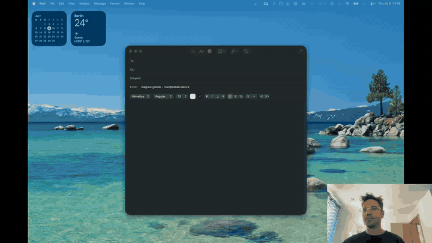

# WhisperShortcut

**Voice-first AI for your Mac.** Press ⌘1 anywhere, speak, and the transcription lands on your clipboard — ready to paste into any app. Speak an instruction (⌘2) to rewrite whatever you copied, have any selected text read aloud (⌘4), or open an AI chat that works with your Calendar, Gmail, Tasks, and Trello (⌥Space).

Bring your own API keys — Gemini, and optionally GPT or Grok — or run fully offline with local Whisper. No account, no subscription, no backend. Open source (AGPL-3.0).



▶️ [Watch the full demo on YouTube](https://youtu.be/gc1s0okfHbU) · Website: [whispershortcut.com](https://whispershortcut.com) · Made by [Magnus Gödde](https://magnus-goedde.de)

## Download

**[⬇️ Get WhisperShortcut on the Mac App Store](https://apps.apple.com/us/app/whispershortcut/id6749648401)** — the easiest way to install, with automatic updates.

- Prefer a direct download? Get the latest signed `.dmg` from [GitHub Releases](https://github.com/mgsgde/whisper-shortcut/releases).
- Cloud features use your Google Gemini API key and, optionally, an xAI API key (Grok chat and TTS) or an OpenAI API key (GPT-5.x chat, transcription, GPT Audio Dictate Prompt, TTS). Offline Whisper needs no key at all.

## Features

- **Dictate**: Record speech and copy the transcription to your clipboard. Use Gemini, OpenAI, or any audio-capable model on OpenRouter, a self-hosted transcription endpoint, or local Whisper models offline. Temperature and thinking effort are configurable for cloud models. Long recordings are split into chunks and processed in parallel.
- **Auto-paste**: Optionally paste the result straight at the cursor instead of only copying it (direct-download version only — it needs the Accessibility permission). Turn on **Restore clipboard** alongside it for a non-destructive paste: whatever you had copied before dictating goes back on the clipboard right after the text is pasted.
- **Copy Last Transcription**: Every dictation result stays available in the menu bar — one entry re-copies the most recent transcription, and a **Recent Transcriptions** submenu holds the last five. Use it when an auto-paste landed in the wrong window, or when a later copy overwrote the clipboard.
- **Dictate Prompt**: Speak an instruction that edits the current clipboard text, for example "make this shorter" or "translate this to English". Supports Gemini and OpenAI audio-input models; optional screenshots can be included with the prompt.
- **Read Aloud**: Press the shortcut on any selected text to copy it and read it aloud with Gemini, OpenAI, or xAI TTS voices. Long texts start playing as soon as the first chunk is synthesized while the rest streams in behind it, so you do not wait for the whole text. Markdown and links are stripped before synthesis, an optional Smart Rewrite pass cleans up code or log output, and playback speed is configurable.
- **Screenshot**: Capture the screen from the menu bar and optionally attach it to Dictate Prompt or chat, or save captures to a folder.
- **Voice Feedback**: Press the shortcut and speak a correction or instruction about how the app should work — for example "my name is spelled G-ö-d-d-e" or "stop capitalizing every noun in Dictate Prompt output". The app turns it into a proposed change to your dictation context (transcription prompt, Whisper glossary, Dictate Prompt, or Chat), which you review in a diff window before it is applied. It is the on-demand, spoken counterpart to Smart Improvement's automatic learning.
- **Chat**: Use a persisted multi-session chat window with Gemini, Grok, or OpenAI models, screenshots, image attachments, slash commands, optional web grounding, and per-session reasoning depth. Grok models additionally search X.com posts, which makes them the best pick for opinions, trends, and breaking social-media chatter — and `/x @handle` narrows that search to the accounts you care about.
- **Google integrations**: Connect a Google account so chat can work with Calendar, Tasks, and Gmail through controlled local tools.
- **Trello integration**: Connect Trello so chat can list boards, lists, and cards and create, move, update, or archive cards.
- **Live Meeting**: Record meetings in chunks, transcribe them as they complete, take live notes into the chat as the meeting goes on, ask the chat about anything said so far, flag moments by shortcut, and save meeting files locally.
- **Send Feedback**: Reach the developer straight from the app — a **Send Feedback** entry in the menu bar (WhatsApp, email, or a GitHub issue), buttons in Settings → About, a **Contact Support** button on every error popup, and `/feedback` in chat, which attaches the end of the conversation. Every route prefills the app and macOS version, and nothing is sent until you press send.
- **Smart Improvement**: Let the app improve system prompts, user context, and the Whisper glossary automatically from usage logs, or on demand from a spoken instruction (see Voice Feedback).

## Requirements

- macOS 15.5 or later
- Xcode 16.0 or later for development
- Google Gemini API key for cloud transcription, Dictate Prompt, chat, TTS, Smart Improvement, and live meetings
- Optional xAI API key for Grok chat models and Grok Voice TTS
- Optional OpenAI API key for GPT-5.x chat, OpenAI transcription (GPT Transcribe, GPT-4o Transcribe), GPT Audio Dictate Prompt, and GPT-4o mini TTS
- Optional OpenRouter account — connect it with one click during onboarding or in Settings → Dictate (no API key to copy, and the flow creates the account if you do not have one; the same connection also covers chat when the custom endpoint points at OpenRouter), or paste a key manually
- Optional Google account connection for Calendar, Tasks, and Gmail tools
- Optional Trello Power-Up API key and token for board, list, and card tools

Offline Whisper dictation works without an API key after downloading a local model in Settings.

## Installation

1. Download the latest `.dmg` from [Releases](https://github.com/mgsgde/whisper-shortcut/releases).
2. Open the DMG and drag `WhisperShortcut.app` into `/Applications`.
3. Start WhisperShortcut from Applications.
4. Open Settings from the menu bar app and add your Google Gemini API key if you want cloud features.
5. Grant microphone and accessibility permissions when macOS asks.

## Common Workflows

Default menu bar shortcuts (all configurable in Settings → General):

| Action | Default shortcut |
| --- | --- |
| Dictate | ⌘1 |
| Dictate Prompt | ⌘2 |
| Screenshot | ⌘3 |
| Read Aloud | ⌘4 |
| Voice Feedback | ⌘5 |
| Flag Meeting Moment | ⌘6 |
| Chat | ⌥Space |
| Settings | ⌘0 |

Press **Stop** in the menu bar (or use the active mode's shortcut again) to cancel recording, TTS playback, or in-flight processing.

To change a shortcut, open Settings → General, click **Record** next to it and press the combination once. Any key works with at least one of ⌘/⌥/⌃, and **F1–F20 can be bound on their own, without a modifier** — that is the binding to use for a programmable (QMK/VIA) keyboard with a dedicated dictation key.

### Dictation

1. Configure a Dictate shortcut in Settings → Dictate.
2. Choose a Gemini, OpenAI, OpenRouter, self-hosted, or Whisper transcription model.
3. Press the shortcut, speak, then stop recording.
4. The transcription is copied to the clipboard and can optionally be pasted automatically.

**Accuracy tuning** (Settings → Dictate, cloud models only):

- **Temperature** — how literally the model reproduces what it heard. `0.0` (the default) is verbatim. The models' own default is `1.0`, which is what the app sent before this setting existed and the most likely source of invented or swapped words.
- **Thinking effort** (Gemini only) — how long the model may reason before transcribing. `Minimal` is the default; raising it can help with hard audio, accents, and unusual vocabulary. On Flash-Lite the latency cost is close to zero; on Pro it roughly doubles. Gemini 3.1 Pro cannot run below `Low` and is clamped to it.

**Which transcription model should I pick?** All of them work; they differ in speed, price, and how they behave on hard audio. Measured on the same recordings in August 2026 — latency is the median of 10 interleaved runs from one machine, so treat it as a ranking, not a guarantee:

| Model | Latency (1.4 s / 8.9 s / 35 s of audio) | Cost per minute | Notable |
|---|---|---|---|
| Grok Speech-to-Text | 0.35 s / 0.97 s / 1.45 s | low | Fastest at every length tested |
| GPT Transcribe | 0.69 s / 0.99 s / 2.04 s | $0.0045 flat | Returns nothing on silence instead of inventing text |
| GPT-4o Mini Transcribe | 0.76 s / 0.97 s / 1.61 s | ~$0.003 | Cheapest cloud option at OpenAI |
| GPT-4o Transcribe | 0.72 s / 1.07 s / 2.16 s | ~$0.006 | Follows Dictation-prompt instructions |
| Gemini 3.1 Flash-Lite | 1.58 s / 1.28 s / 1.83 s | ~$0.001 | Best glossary adherence of the Gemini tiers |
| Gemini 3.5 Flash-Lite | 1.86 s / 2.97 s / 6.63 s | ~$0.001 | Slowest tested; see the caveat below |
| Whisper (offline) | depends on your Mac and model size | free | Runs locally, nothing leaves your machine |

Recommendations by what you care about:

- **Lowest latency** — Grok Speech-to-Text, by a clear margin on short and long recordings alike.
- **Cheapest cloud** — Gemini Flash-Lite, roughly 4× cheaper per minute than GPT Transcribe. Gemini bills audio *and* output tokens, so a long transcript costs more; GPT Transcribe bills only recording length, which makes it easier to predict.
- **Privacy** — an offline Whisper model. No audio leaves your Mac.
- **Names and jargon spelled right** — put them in the Glossary first; that matters more than the model. Among the Gemini tiers, 3.1 Flash-Lite reproduced glossary terms noticeably more reliably than 3.5 Flash-Lite in our tests.
- **A Dictation prompt with formatting rules** — use a Gemini model or GPT-4o Transcribe. GPT Transcribe and Grok are pure speech-to-text and ignore instructions in the prompt.

**A note on silence.** If a recording is silent or unintelligible, some models invent a plausible-sounding sentence built from your Glossary instead of returning nothing. WhisperShortcut filters implausible transcripts, but the filter cannot catch every case: in our tests Gemini 3.5 Flash-Lite produced normal-length invented sentences that passed the filter, while Gemini 3.1 Flash-Lite's inventions were long enough to be caught and GPT Transcribe returned nothing at all. If you often start recording before you start speaking, that is worth knowing when picking a model.

**GPT Transcribe** (OpenAI): OpenAI's current transcription model, billed by audio duration rather than tokens. It is a pure speech-to-text model, so it ignores the Dictation system prompt; your Glossary still applies and is sent as keyword hints, which in testing was the more reliable way to get names and product terms spelled right. Unlike the GPT-4o transcription models, it returns an empty transcript on silence instead of echoing the glossary back.

**OpenRouter**: select the OpenRouter transcription model, then click **Connect OpenRouter Account** in Settings → Dictate. That opens OpenRouter in a browser sheet where you sign in — or create an account, if you do not have one — and approve; the app receives its key directly, so there is nothing to copy and paste. You pay OpenRouter for what you use, and can top up or revoke access from your OpenRouter dashboard at any time. If you already hold a key, "Enter an API key manually instead" still accepts it. The same connection covers chat as well: use the **Use OpenRouter preset** button in Settings → Chat and no key is needed there either. The model list in Settings → Dictate is fetched live from OpenRouter and filtered to models that actually accept audio, with rough prices shown, so there is no slug to look up or memorise — pick one from the menu. New models appear as OpenRouter adds them, without an app update. "Custom slug…" still lets you type anything, for models the list does not cover. OpenRouter has no dedicated transcription endpoint, so the audio is sent as a chat message; that means your Dictation system prompt and Glossary apply here, unlike the OpenAI and self-hosted transcription endpoints.

### Dictate Prompt

1. Copy text you want to edit.
2. Press the Dictate Prompt shortcut.
3. Speak an instruction, such as "turn this into bullet points".
4. The edited result is copied to the clipboard.

Optional: capture a screenshot (⌘3 or chat `/screenshot`) before or during the prompt when screenshot-in-prompt mode is enabled.

### Read Aloud

1. Select text in any app.
2. Press the Read Aloud shortcut.
3. The selection is copied and read aloud with your chosen TTS model and voice.

Use Settings → Read Aloud to pick the TTS provider, voice, Smart Rewrite, and playback speed. Chat replies can also be read aloud from the message actions.

### Screenshot

Press the Screenshot shortcut to capture the screen. Captures can be attached to the next Dictate Prompt or chat message, or saved to a folder when that option is enabled in Settings → Screenshot.

### Chat

Open the chat window from the menu bar or its configured shortcut. Chat sessions are stored locally.

Core slash commands:

- `/new` — start a new chat
- `/screenshot` — attach a screenshot to your next message
- `/attach` — open the file picker for PDFs, images, or text
- `/model` — switch model (e.g. `/model 3.5 flash`)
- `/think` — set reasoning depth for this chat (`minimal`, `low`, `medium`, `high`, or `default`)
- `/x` — Grok only: limit X search to specific accounts for this chat (e.g. `/x @karpathy @simonw`); `/x off` searches all of X again. Set a default under Settings → Chat
- `/settings` — open Settings
- `/pin` / `/unpin` — keep the window open or close on focus loss
- `/meeting` — start or stop live meeting recording
- `/copy` — copy the chat history as Markdown

`/feedback` opens a message to the developer with the end of the current chat quoted, so a problem you were just discussing does not have to be described twice.

Model shortcuts include `/gemini`, `/grok`, `/gpt`, `/openai`, and per-model aliases such as `/gemini35flash`. Gemini models use your Google API key, Grok models use your xAI API key, and OpenAI models use your OpenAI API key.

Connect Google or Trello in Settings → Chat to unlock the corresponding chat tools.

### Live Meeting

Type `/meeting` in chat to start and stop live meeting recording. Audio is rotated into chunks, transcribed, and appended to the meeting transcript. Saved transcripts live in the app's Application Support folder.

While a meeting runs:

- **Live notes appear in the chat itself.** Every minute or two the app appends one or two bullets covering what was just discussed, woven into the chat stream at the moment it was said — so you can see what is going on in the same column where you type. Earlier notes are never rewritten.
- **The chat sees the entire transcript**, not just the last few minutes, so you can ask about anything said since the meeting started. A line above the composer says exactly what the chat can currently see. When you send a question, the audio still sitting in the recorder is cut and transcribed first, so the answer covers what was said seconds ago too.
- **One-tap questions** above the composer: Catch me up, Action items, Open questions, Decisions.
- **Ask about a moment**: hover any note and press *Ask* to quote it into the composer instead of retyping it.
- **Flag a moment** with the meeting-marker shortcut (⌘6 by default, configurable in Settings → Chat). Markers show up in the note stream and the final summary is written around what you flagged.
- **Copy transcript** in the meeting bar puts the raw transcript on the clipboard; right-click it to reveal the file in Finder.

While the meeting runs there is only the chat — the notes are already in it. Once a meeting has ended, its view has two tabs: **Chat** and **Notes**, where Notes holds the final summary. Chunks rotate faster while the chat window is on screen so the live view keeps up, and fall back to the configured interval when it is not.

Dictate and Dictate Prompt keep working during a meeting, and the menu bar shows which of the two recordings is running: 📝 for the meeting, 🔴 / 🤖 while you dictate on top of it. Stopping a meeting is not instant — the last chunk still has to be transcribed — so the meeting bar says **Finishing…** and the menu bar shows ⏳ until the transcript and summary are saved.

### Smart Improvement

In Settings → General, enable **Save usage data** if you want the app to learn from your interactions. Then use **Improve from usage** or **Generate with AI** to review suggested updates to system prompts, user context, or the Whisper glossary before accepting them.

## Build From Source

```bash
git clone https://github.com/mgsgde/whisper-shortcut.git
cd whisper-shortcut
bash install.sh
```

For development, build and restart the app with:

```bash
bash scripts/rebuild-and-restart.sh
```

Useful scripts:

- `scripts/rebuild-and-restart.sh`: Build Debug, sync bundled docs, and restart the local app.
- `scripts/logs.sh`: Stream or filter app logs.
- `scripts/create-release.sh`: Create a tagged release.
- `scripts/test-gemini-models.sh`, `scripts/test-grok-models.sh`, `scripts/test-openai-models.sh`: Check provider model availability and basic responses.

## Project Structure

- `WhisperShortcut/`: Swift source for the macOS app.
- `WhisperShortcut/Docs/`: User-facing markdown bundled with the app (mirrored from the repo README and data-directory docs on rebuild).
- `WhisperShortcut.xcodeproj/`: Xcode project and shared schemes.
- `scripts/`: Local development and release helper scripts.
- `.github/workflows/release.yml`: GitHub Actions workflow for signed, notarized release builds.
- `plans/`: Shared implementation plans and specs.
- `.cursor/`: Cursor agent commands, skills, and rules (see `.cursor/commands/README.md`).

Core files:

- `AppState.swift`: Central app state machine.
- `MenuBarController.swift`: Main app orchestrator.
- `SpeechService.swift`: Dictation, Dictate Prompt, and Read Aloud logic.
- `ChatView.swift`: Chat UI and view model.
- `ChatTools.swift`: `ChatToolRegistry` and local, Google, and Trello chat tools.
- `TranscriptionModels.swift`: Gemini, OpenAI, Whisper, and self-hosted transcription models.
- `Settings/`: Settings UI, defaults, and persistence.

## Data And Privacy

WhisperShortcut stores settings, chat sessions, meeting transcripts, usage logs, short-lived Smart Improvement audio samples, and downloaded models on your Mac. API keys, OAuth refresh tokens, and Trello tokens are stored in Keychain.

WhisperShortcut uses one canonical app data location so sandboxed and non-sandboxed builds see the same files:

`~/Library/Containers/com.magnusgoedde.whispershortcut/Data/Library/Application Support/WhisperShortcut/`

See the App Data Location section in [`privacy.md`](privacy.md#app-data-location) for what each subfolder contains.

## License

GNU Affero General Public License v3.0 (AGPL-3.0). See [LICENSE](LICENSE) for details.
