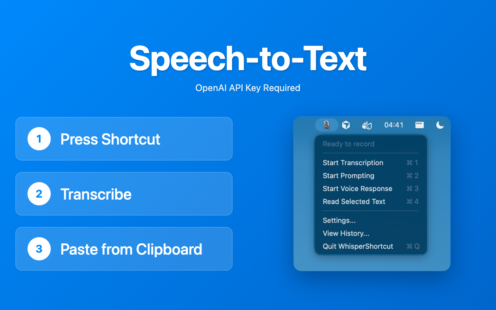

# WhisperShortcut

**Speech-to-Text** and **Voice-to-Prompt** shortcut for macOS with **Google Gemini** and **Offline Whisper** support

<div align="center">
  
</div>

📺 **[Watch Demo Video](https://youtu.be/ZaD2iSZ0Y2M)**

## Download & Support

**[Download for FREE via GitHub Releases](https://github.com/mgsgde/whisper-shortcut/releases)**

### Support the Project

WhisperShortcut is open source and free to use. If you want to support the development, you can purchase and review the app on the App Store:

**[Buy on Mac App Store](https://apps.apple.com/us/app/whispershortcut/id6749648401)**

## How it works

### Transcription Mode (Speech-to-Text)

Choose between **cloud** (Google Gemini) or **offline** (Whisper) transcription:

1. **Setup** - For cloud transcription: Configure your Gemini API key [here](https://aistudio.google.com/app/apikey). For offline transcription: Download a Whisper model in Settings (no API key needed).
2. **Press Shortcut** - Start recording with a keyboard shortcut
3. **Transcribe** - Uses your selected model (Gemini or Whisper) for accurate speech-to-text
4. **Copy to Clipboard** - Automatically copies transcription to your clipboard

**Advanced Features:**

- **Chunked Transcription**: Long recordings are automatically split into chunks and processed in parallel for better performance
- **Real-time Progress**: See the status of each chunk as it's being processed

### Prompt Mode (Voice-to-Prompt)

Speak instructions that apply to selected clipboard text:

1. **Select Text** - Copy text you want to modify to your clipboard
2. **Press Shortcut** - Start recording your voice instruction
3. **Process** - Gemini processes both your voice instruction and the selected text
4. **Get Result** - Modified text is automatically copied to your clipboard

### Read Aloud Mode (Text-to-Speech)

Read selected text aloud using AI-powered voices:

1. **Select Text** - Copy text you want to hear to your clipboard
2. **Press Shortcut** - Start the read aloud process
3. **Listen** - Selected text is read aloud using your chosen voice

### Prompt & Read Mode

Combine AI prompting with text-to-speech in one workflow:

1. **Select Text** - Copy text you want to modify to your clipboard
2. **Press Shortcut** - Start recording your voice instruction
3. **Process & Read** - Gemini processes your voice instruction and selected text, then reads the result aloud automatically

### Live Meeting Transcription

Real-time transcription that streams into a text file as you speak (e.g. for meetings or calls):

1. **Start** - Click "Transcribe Meeting" in the menu bar (requires Gemini API key)
2. **File Opens** - A transcript file is created at `~/Documents/WhisperShortcut/Meeting-<timestamp>.txt` and opens in your default editor
3. **Streaming** - Audio is recorded in chunks (e.g. every 15 seconds), transcribed with Gemini, and appended to the file
4. **Optional Timestamps** - Enable `[MM:SS]` markers in Settings → Live Meeting
5. **Stop** - Click "Stop Transcribe Meeting" when done

Use the live transcript with AI assistants in your editor (e.g. Cursor) while the meeting runs.

### Smart Improvement

You can improve your system prompts and user context in two ways:

1. **Improve from usage** – In Settings → Smart Improvement, enable **"Save usage data"** so the app stores interaction logs (what you dictated, which mode you used). When you have enough data, click **"Improve from usage"**. Gemini (model selectable in Settings) analyzes your logs and suggests updates for: **User Context** (language, topics, style), **Dictation** (Speech-to-Text system prompt), **Dictate Prompt** system prompt, and **Prompt & Read** system prompt. Suggestions are applied automatically; a popup tells you what was improved. Check the relevant settings tabs to review or edit.
2. **Improve from voice** – Use the **Improve from voice** shortcut (e.g. Cmd+6). Record a voice instruction (e.g. "always add bullet points", "I work in legal"); the app transcribes it and updates system prompts accordingly. No interaction logs required.

**Settings** (Settings → Smart Improvement): **Save usage data** (off by default), **model** (default: Gemini 3.1 Pro), and the **Improve from voice** shortcut. The same model is used for "Generate with AI" in the prompt and user-context settings.

## Installation

### Recommended: Download App

1. Download the latest `.dmg` file from the [Releases page](https://github.com/mgsgde/whisper-shortcut/releases).
2. Open the DMG and drag `WhisperShortcut` to your Applications folder.

### Build from Source

```bash
# Clone the repository
git clone https://github.com/mgsgde/whisper-shortcut.git
cd whisper-shortcut

# Install the app
bash install.sh
```

## Features

- **Speech-to-Text Transcription**: Audio → Text transcription using Google Gemini (cloud) or Whisper (offline)
  - **Chunked Transcription**: Automatic parallel processing of long recordings for improved performance
  - **Real-time Progress Tracking**: Visual status grid showing progress of each audio chunk
- **Voice-to-Prompt Mode**: Speak instructions to modify selected clipboard text using Gemini AI
- **Read Aloud Mode**: Text-to-speech functionality to read selected text aloud with AI voices
- **Prompt & Read Mode**: Combined workflow that processes text with AI and reads the result aloud
- **Offline Support (Privacy Mode)**: Use local Whisper models for completely offline transcription
- **Smart Clipboard Integration**: Automatic copy to clipboard for transcription and prompt modes
- **Customizable Shortcuts**: Configurable keyboard shortcuts for each mode
- **Multiple TTS Models & Voices**: Choose from Gemini 2.5 Flash/Pro TTS models and 10 AI voices (e.g. Charon, Puck, Kore)
- **Live Meeting Transcription**: Real-time transcription streamed to a text file; configurable chunk interval and timestamps; file opens in your default editor
- **Smart Improvement**: Manual system prompt and user context improvements via "Improve from usage" (requires enabling "Save usage data") or "Improve from voice" shortcut; suggestions applied automatically; review or edit in the relevant settings tabs

## Development

### Prerequisites

- macOS 15.5+
- Xcode 16.0+
- Gemini API key (required only for cloud transcription and prompt mode; optional for offline Whisper transcription)

### App identifiers (signing, App Store)

| Identifier      | Value            | Where used |
|-----------------|------------------|------------|
| **Bundle ID**   | `com.magnusgoedde.whispershortcut` | Info.plist, Xcode |
| **Team ID**     | `Z59J7V26UT`     | Xcode signing |
| **App Store ID**| `6749648401`     | App Store link (optional) |

## License

MIT License - see [LICENSE](LICENSE) file for details.

---

Made in Karlsruhe, Germany 🇩🇪 by [@mgsgde](https://github.com/mgsgde)
